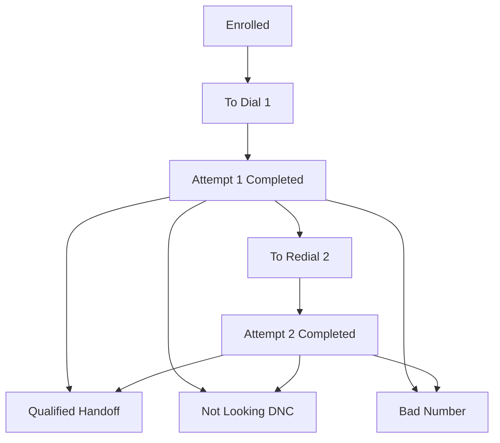
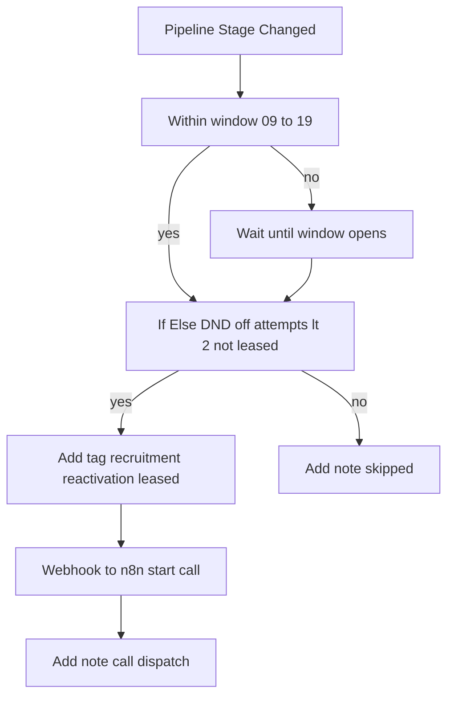
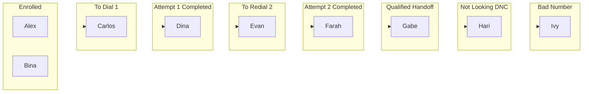

# Lead Reactivation — Jannis 750k Case Study

This is a simple, friendly guide that explains how our system works, step by step, with no technical words. Think of it like a helpful story about how we call old candidates, learn what they want, and send the good ones to a recruiter.

---

## What this system does

- **Wake up old contacts**. We reach out to people who applied in the past to see if they still want a job.
- **Ask quick questions**. We collect a few key answers so your team knows who is worth a call back.
- **Move cards on a board**. Every person is a “card” on a pipeline board. Cards move from left to right as they progress.
- **Hand off winners to a recruiter**. If someone is ready and qualified, we move their card into a special handoff stage.

---

## The main pieces (in plain words)

- **GHL (GoHighLevel)**: Our master list of people. It has a board with columns (the pipeline) and simple stickers we can add (tags).
- **Pipeline**: The board with columns. The columns we use are:
  - Enrolled
  - To Dial – Attempt 1
  - Attempt 1 Completed
  - To Redial – Attempt 2
  - Attempt 2 Completed (No Answer)
  - Qualified → Handoff
  - Not Looking / DNC
  - Bad Number

#### Visual: Pipeline at a glance

- **Workflows**: Little robots that do actions for us, like “move card,” “add a note,” or “send a text.”
- **Tags**: Small labels to mark events. We use namespaced tags like:
  - `recruitment.reactivation.enrolled`
  - `recruitment.reactivation.leased`
  - `recruitment.reactivation.attempt1.done`
  - `recruitment.reactivation.attempt2.done`
  - `recruitment.reactivation.qualified`
  - `recruitment.reactivation.dnc`
  - `recruitment.reactivation.bad_number`
- **Custom fields**: Simple boxes to save answers and status. Examples:
  - `calls_attempt_count` — how many times we tried to call
  - `next_attempt_at` — when we should try calling next
  - `last_disposition` — the last outcome, like answered or no answer
  - `ai_call_summaries` — short notes from the AI about the call
  - `ai_candidate_experience`, `ai_salary_expectation`, `ai_availability`, `ai_recording_urls`
- **Call engine (outside GHL)**: When it is time to call, we send a safe message (webhook) to our call system (through n8n). That system places the actual phone call and sends results back.

---

## The journey for one candidate

1) **Enrollment**
- We add the tag `recruitment.reactivation.enrolled` to a person.
- The system sets starting values (like attempt count = 0) and puts the card in the Enrolled column.

2) **Dial start (Lease Start)**
- When we are ready to try calling, we add `recruitment.reactivation.leased` and move the card to either:
  - To Dial – Attempt 1 (first try), or
  - To Redial – Attempt 2 (second try).
- This “leased” tag is like a lock. It means “someone is trying to call right now; do not double-dial.”

3) **Call orchestration (time window safe)**
- A special workflow watches for cards entering the “dialable” stages (To Dial 1 or To Redial 2).
- Only between 9am and 7pm, it sends a webhook to the call system to start the call.
- If it’s outside the window, it waits and tries when the window opens.

#### Visual: Call orchestration window

4) **During and after the call**
- The call system tries the number. If no answer the first time, we can try again (second attempt).
- After the call, the call system sends back what happened:
  - If they answered and are a good fit → move to “Qualified → Handoff”.
  - If they did not answer → move to “Attempt 1 Completed” or “Attempt 2 Completed (No Answer)”.
  - If the number is bad → move to “Bad Number”.
  - If they say stop texting/calling → move to “Not Looking / DNC” and turn on Do Not Disturb (DND).
- The “leased” tag is removed when the call is finished.

5) **SMS fallback**
- If we tried two times and still no answer, the system can send a gentle SMS.

6) **Recruiter handoff**
- When a person is qualified, we put their card in “Qualified → Handoff,” assign a recruiter, and leave a note.

---

## What you will see in GHL

- **A folder of workflows** that do small jobs:
  - Enrollment, Lease Start, Outcome handling, Qualified Handoff, DNC Handling, Bad Number, SMS Fallback, Call Orchestration.
- **Cards moving across the pipeline** as people progress.
- **Notes** added automatically so you can read what happened.
- **Tags** appearing and disappearing as the process runs.

#### Visual: Sample board with leads

---

## The important rules (safety rails)

- **Respect DND**. If a person opts out, we stop.
- **Time window**. Calls only dispatch 9am–7pm so we do not disturb people early or late.
- **No double-dial**. The `recruitment.reactivation.leased` tag is our “no duplicates” lock.
- **Two tries**. We try up to two calls. After that, we switch to a friendly text.

---

## Simple checklist to run a campaign

- **Step 1**. Import your list and add tag `recruitment.reactivation.enrolled`.
- **Step 2**. Make sure the custom fields exist (they do) and the workflows are on.
- **Step 3**. Move cards into To Dial – Attempt 1 (or let a workflow/n8n do it).
- **Step 4**. The Call Orchestration workflow sends the call (inside 9am–7pm).
- **Step 5**. Watch the pipeline columns update as outcomes come in.
- **Step 6**. Follow up with people in “Qualified → Handoff.”

---

## What gets saved about each call

- **How many tries** → `calls_attempt_count`
- **When to try again** → `next_attempt_at`
- **What happened last time** → `last_disposition`
- **AI notes and details** → `ai_call_summaries`, `ai_candidate_experience`, `ai_salary_expectation`, `ai_availability`, `ai_recording_urls`

---

## Common questions

- **Can this start calls by itself?**
  - Yes. When a card enters a dialable stage, a workflow sends a webhook to the call system.
- **What if it’s too early or too late?**
  - The call orchestration workflow waits until the 9am–7pm window.
- **What if the person says stop?**
  - We move them to Not Looking / DNC and enable DND so we do not contact them again.

---

## Tiny glossary

- **Pipeline**: A board with columns that show where each person is.
- **Tag**: A small label (like a sticker) that marks an event.
- **Workflow**: A little robot that does actions in order.
- **Webhook**: A simple message we send to the call system to start a call.
- **DND**: Do Not Disturb. If it’s on, we do not contact the person.

---

## The big picture

This system is like a tidy assembly line. It politely calls old candidates, writes down what they say, moves their card to the right spot, and taps a recruiter on the shoulder for the good ones. You get more placements with less manual work.
