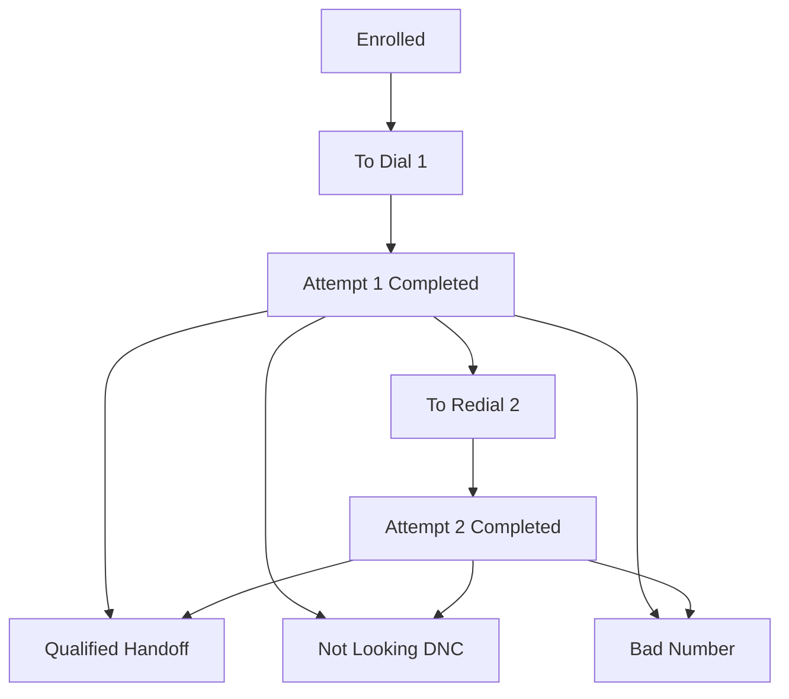
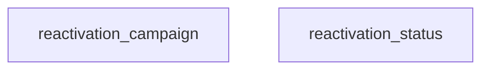
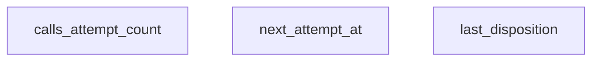
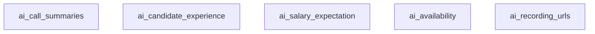

# GHL Details: Lead Reactivation – Jannis 750k

This document captures GHL components for the Recruitment Lead Reactivation use case. Mermaid diagrams follow hygiene rules and use vertical flow.

Sources:
- `Recruitment/gpt chat brainstorming/chat.md`
- `Recruitment/Usecases/Lead reactivation/Jannis 750k Case Study/Overview.md`

---

## 1) Pipeline and stages

### Lead Reactivation pipeline

- **Purpose**: reactivate old candidates and route qualified ones to recruiters.
- **When created**: on CSV import with tag `recruitment.reactivation.enrolled` or via n8n enrollment.
- **Transitions**: Enrolled → To Dial Attempt 1 → Attempt 1 Completed → To Redial Attempt 2 → Attempt 2 Completed (No Answer) → Qualified → Handoff or Not Looking / DNC or Bad Number.
- **Automations**: leasing via `recruitment.reactivation.leased`, stage moves, notes, SMS fallback, DND handling.
- **Stages**:
  - Enrolled
  - To Dial – Attempt 1
  - Attempt 1 Completed
  - To Redial – Attempt 2
  - Attempt 2 Completed (No Answer)
  - Qualified → Handoff
  - Not Looking / DNC
  - Bad Number

---

## 2) Custom fields

### Core campaign fields

- `reactivation_campaign` text
- `reactivation_status` text

### Attempt control fields

- `calls_attempt_count` number
- `next_attempt_at` datetime
- `last_disposition` text

### AI capture fields

- `ai_call_summaries` text
- `ai_candidate_experience` text
- `ai_salary_expectation` text
- `ai_availability` text
- `ai_recording_urls` text

### AI capture – extended fields (populated by call outcomes)

- `ai_transcripts` long text
- `ai_preferred_contact` enum text (sms|phone|email|unspecified)
- `ai_preferred_contact_alt` enum text (sms|phone|email|unspecified)
- `ai_location_confirmed` text
- `ai_desired_roles` text (JSON array string)
- `ai_new_skills` text (JSON array string)
- `ai_salary_min` text (store number as string if needed by GHL API)
- `ai_salary_max` text
- `ai_currency` text (e.g., USD)
- `still_looking` text (true|false|unspecified)

```mermaid
flowchart TB
  CF_AITrans[ai_transcripts]
  CF_AIPref[ai_preferred_contact]
  CF_AIPrefAlt[ai_preferred_contact_alt]
  CF_Location[ai_location_confirmed]
  CF_Roles[ai_desired_roles]
  CF_Skills[ai_new_skills]
  CF_SMin[ai_salary_min]
  CF_SMax[ai_salary_max]
  CF_Currency[ai_currency]
  CF_StillLooking[still_looking]
```

---

## 3) Automation workflows

- **Enrollment workflow**: Trigger Tag added = `recruitment.reactivation.enrolled`. If `calls_attempt_count` empty set to 0. Set `reactivation_campaign`. Move stage to Enrolled. Set `next_attempt_at` to now or next 9am in timezone. Add a note.
- **n8n scheduler and lease**: Query contacts with `recruitment.reactivation.enrolled`, `calls_attempt_count` < 2, `next_attempt_at` <= now, not DND, not `recruitment.reactivation.leased`. For each: add `recruitment.reactivation.leased`, move stage to To Dial Attempt 1 or To Redial Attempt 2, add note, launch call.
- **Outbound events**: On call webhook: increment `calls_attempt_count`. Set `reactivation_status`. Write AI fields. Move stage to Qualified Handoff when rules match, else Attempt 1 Done or keep simple Completed. Remove `recruitment.reactivation.leased`. Add note summary.
- **No answer and voicemail**: Mark status, move to Attempt 1 Done or Attempt 2 Done as appropriate. Consider SMS fallback.
- **SMS fallback**: Trigger when `calls_attempt_count` == 2 and last disposition not answered. Send SMS from GHL.
- **DNC handling**: On opt out or DNC detection: flip DND on, add `recruitment.reactivation.dnc`, move to Not Looking DNC, clear `next_attempt_at`, remove `recruitment.reactivation.leased` and remove `recruitment.reactivation.enrolled` (terminal).
- **Bad number terminal**: When `reactivation_status = bad_number`: move to Bad Number, clear `next_attempt_at`, remove `recruitment.reactivation.leased` and `recruitment.reactivation.enrolled`.
- **Guardrails**: Respect DND. Stay within call window. Use `recruitment.reactivation.leased` as lock to prevent double dials.

> Safety / Anti-loop guidance
>
> - Only one workflow should move an opportunity for a given event.
> - Outcome workflows are field-driven (`reactivation_status`) and also clear the `recruitment.reactivation.leased` lock.
> - Qualified handoff is tag-driven (`recruitment.reactivation.qualified`) so all qualification funnels through a single mover.
> - On terminal outcomes (Qualified / DNC / Bad Number), remove `recruitment.reactivation.enrolled` so future CSV batches don’t re-pull resolved records.

---

## 4) Tags

- `recruitment.reactivation.enrolled`
- `recruitment.reactivation.leased`
- `recruitment.reactivation.attempt1.done`
- `recruitment.reactivation.attempt2.done`
- `recruitment.reactivation.qualified`
- `recruitment.reactivation.dnc`
- `recruitment.reactivation.bad_number`
- Optional campaign tag such as `campaign Jannis750k`

Notes:
- `recruitment.reactivation.enrolled` is the batch entry tag and is removed on terminal outcomes (Qualified / DNC / Bad Number).
- `recruitment.reactivation.leased` is an active lock tag set before dialing and cleared by outcome workflows and terminal flows.

---

## 5) Notes

- Use GHL Notes to log enrollment, lease start, dial outcomes, and short summaries.
- Keep stage names and labels short and Mermaid safe. Vertical flows only.
- n8n remains the orchestrator and updates GHL via API. VocalGrid handles dialing and posts events back to n8n.
