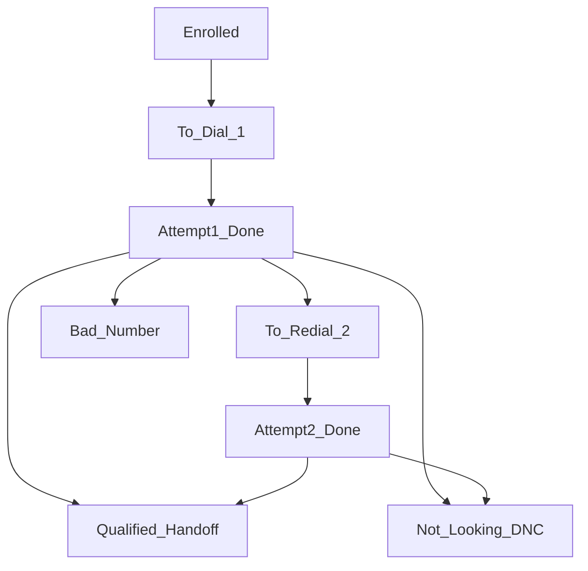

# Cascade Chat Conversation

  Note: _This is purely the output of the chat conversation and does not contain any raw data, codebase snippets, etc. used to generate the output._

### User Input

i was discussing thsi with you in browser gpt5 session

Recruitment\gpt chat brainstorming\chat.md


we need to out the workflow logic mmd and md files for GHL like we have for other usecase
Healthcare\Vet\Usecases
Healthcare\Vet\Supabase to work with GHL\ghl-details.md
Healthcare\Vet\Supabase to work with GHL\ghl-mappings.mmd


we need to make pipelines, wortkflows , tags etc plan for thius usecase:
Recruitment\gpt chat brainstorming\chat.md

make iut here:L
Recruitment\Usecases\Lead reactivation\Jannis 750k Case Study

### Planner Response

I'll create a short task plan so you can track progress, then locate the reference Vet GHL files and your Recruitment brainstorming chat to mirror the structure. After reviewing them, I'll draft the new GHL details (md) and mappings (mmd) for the Jannis 750k case study and write them into the specified folder.

*Updated todo list*

### Planner Response

I'll locate the reference Vet GHL files and the Recruitment brainstorming chat, as well as confirm the target case study folder. Then I'll open and review their contents to mirror the structure accurately. Running file searches in parallel for speed.

*Searched filesystem*

*Searched filesystem*

*Searched filesystem*

*Searched filesystem*

### Planner Response

I'm going to read the Vet reference files to mirror their structure, search your Recruitment brainstorming chat for the Jannis 750k details, and confirm the target case study folder. Running these in parallel for speed.

*Viewed [ghl-details.md](file:///c:/Users/dagt1/OneDrive/Desktop/projects/jujhaar-ai-infra-projects/content/Healthcare/Vet/Supabase%20to%20work%20with%20GHL/ghl-details.md) *

*Viewed [ghl-mappings.mmd](file:///c:/Users/dagt1/OneDrive/Desktop/projects/jujhaar-ai-infra-projects/content/Healthcare/Vet/Supabase%20to%20work%20with%20GHL/ghl-mappings.mmd) *

*Grep searched codebase*

*Grep searched codebase*

*Searched filesystem*

### Planner Response

I'll search within the brainstorming chat for the Jannis 750k and reactivation details, and scan for pipeline/workflow/tag specifics. I'll also list the target parent directory to confirm whether the case study folder exists. Running these in parallel.

*Grep searched codebase*

*Grep searched codebase*

*Listed directory [Lead%20reactivation](file:///c:/Users/dagt1/OneDrive/Desktop/projects/jujhaar-ai-infra-projects/content/Recruitment/Usecases/Lead%20reactivation) *

*Listed directory [Jannis%20750k%20Case%20Study](file:///c:/Users/dagt1/OneDrive/Desktop/projects/jujhaar-ai-infra-projects/content/Recruitment/Usecases/Lead%20reactivation/Jannis%20750k%20Case%20Study) *

### Planner Response

- **Why I'm using tools**:
  - I'll create the two new documentation files in the target case study folder, mirroring the Vet format and applying Mermaid hygiene.
  - After writing, I'll confirm the files exist and update the task plan.

Proceeding to create [ghl-details.md](cci:7://file:///c:/Users/dagt1/OneDrive/Desktop/projects/jujhaar-ai-infra-projects/content/Healthcare/Vet/Supabase%20to%20work%20with%20GHL/ghl-details.md:0:0-0:0) and [ghl-mappings.mmd](cci:7://file:///c:/Users/dagt1/OneDrive/Desktop/projects/jujhaar-ai-infra-projects/content/Healthcare/Vet/Supabase%20to%20work%20with%20GHL/ghl-mappings.mmd:0:0-0:0) in the specified directory.

*Edited relevant file*

*Edited relevant file*

*Updated todo list*

*Updated todo list*

### Planner Response

# Files created

- **ghl-details.md**
  - Path: Recruitment/Usecases/Lead reactivation/Jannis 750k Case Study/ghl-details.md
- **ghl-mappings.mmd**
  - Path: Recruitment/Usecases/Lead reactivation/Jannis 750k Case Study/ghl-mappings.mmd

# What’s inside

- **Pipelines and stages**
  - Lead Reactivation pipeline with concise, Mermaid-safe vertical flow:
    - Enrolled → To Dial 1 → Attempt1 Done → To Redial 2 → Attempt2 Done → Qualified / Not Looking / Bad Number / Failed
  - Clear transitions tied to events (lease, call outcomes, DNC).

- **Custom fields**
  - Campaign/status: `reactivation_campaign`, `reactivation_status`
  - Control: `attempt_count`, `next_attempt_at`, `last_disposition`
  - AI capture: `ai_summary`, `ai_experience`, `ai_salary`, `ai_availability`, `ai_recording_url`, `ai_transcript_url`

- **Workflows**
  - Enrollment workflow on `reactivation.enrolled` tag.
  - n8n scheduler + leasing tag `reactivation.leased`.
  - Outbound call event handling, stage moves, note logging.
  - SMS fallback trigger at 2 attempts.
  - DND guardrails and call window respect.

- **Tags**
  - `reactivation.enrolled`
  - `reactivation.leased`
  - `reactivation.attempt1.done`
  - `reactivation.attempt2.done`
  - `reactivation.qualified`
  - `reactivation.dnc`
  - `reactivation.bad_number`
  - Optional: `campaign.Jannis750k` (can adjust to your naming)

- **Mappings diagram**
  - GHL Contacts/Fields/Tags/Pipeline ↔ Supabase `campaigns`, `candidates`, `campaign_candidates`, `call_tasks`, `call_attempts`, `extractions`, `recruiter_leads`
  - Automations glue for n8n and VocalGrid events

# Assumptions

- Two attempts max before SMS fallback (per chat notes).
- Leasing via `reactivation.leased` tag to prevent double-dials.
- Stage names kept short and Mermaid-safe; adjust if you prefer different stage labels.
- Optional campaign tag can encode this specific case study.

# Recommended next tweaks

- **Confirm stage labels**: Any renames you want for board columns?
- **Confirm tag set**: Add/remove any tags for reporting you care about.
- **Campaign naming**: Finalize a campaign tag, e.g., `campaign.Jannis750k`.
- **IDs**: If you want, I can add a section for storing GHL pipeline/stage/field IDs for repeatable setup.

# Task status

- **Created and populated both files**, mirrored format and hygiene from the Vet references.
- **Todo plan completed**. Happy to iterate quickly on labels/tags or add an IDs section if you provide your preferred names.

### User Input

make the workflows folder and make mmd and md files on the nodes etc i need to have in ghl workflow so i can look at it and make in GHL

*Updated todo list*

### Planner Response

I will create a new workflows folder under the Jannis 750k Case Study and add paired .md and .mmd files for each GHL workflow, with concise node steps and Mermaid diagrams that you can mirror in GHL. Executing file creations in parallel.

*Edited relevant file*

*Edited relevant file*

*Edited relevant file*

*Edited relevant file*

*Edited relevant file*

*Edited relevant file*

*Edited relevant file*

*Edited relevant file*

*Edited relevant file*

*Edited relevant file*

*Edited relevant file*

*Edited relevant file*

*Edited relevant file*

*Edited relevant file*

*Updated todo list*

### Planner Response

# Workflows folder and files created

- **Folder**
  - Recruitment/Usecases/Lead reactivation/Jannis 750k Case Study/workflows

- **Files (each has .md steps and .mmd diagram)**
  - 01-enrollment.md / 01-enrollment.mmd
  - 02-lease-start.md / 02-lease-start.mmd
  - 03-qualified-handoff.md / 03-qualified-handoff.mmd
  - 04-outcome-no-answer-voicemail.md / 04-outcome-no-answer-voicemail.mmd
  - 05-sms-fallback.md / 05-sms-fallback.mmd
  - 06-dnc-handling.md / 06-dnc-handling.mmd
  - 07-bad-number.md / 07-bad-number.mmd

I followed the Mermaid hygiene from the Vet diagrams memory: short labels, no punctuation that breaks Mermaid, vertical flow.

# How to mirror in GHL

- **01 Enrollment**
  - Trigger: Tag added reactivation.enrolled
  - Actions: If empty attempt_count → set 0. Set reactivation_campaign. Move stage Enrolled. Set next_attempt_at. Add note.

- **02 Lease Start (Dial prep)**
  - Trigger: Tag added reactivation.leased
  - Actions: Set reactivation_status in_progress. If attempt_count 0 → Move stage To Dial 1 else To Redial 2. Add note.

- **03 Qualified Handoff**
  - Trigger: Tag added reactivation.qualified
  - Actions: Move stage Qualified Handoff. Create/advance Opportunity. Assign user. Add note. Optional internal notification.

- **04 Outcome No Answer or Voicemail**
  - Trigger: Field change reactivation_status
  - Conditions: no_answer or voicemail
  - Actions: If attempt_count 1 → Move stage Attempt 1 Done + tag reactivation.attempt1.done. If 2 → Attempt 2 Done + tag reactivation.attempt2.done. Remove reactivation.leased. Add note.

- **05 SMS Fallback**
  - Trigger: Field change or scheduled check
  - Condition: attempt_count 2 and last_disposition not answered
  - Actions: Send SMS. Add note.

- **06 DNC Handling**
  - Trigger: Tag added reactivation.dnc or DND turned on
  - Actions: Set DND on. Move stage Not Looking DNC. Clear next_attempt_at. Remove reactivation.leased. Add note.

- **07 Bad Number**
  - Trigger: Tag added reactivation.bad_number or reactivation_status set bad_number
  - Actions: Move stage Bad Number. Clear next_attempt_at. Remove reactivation.leased. Add note.

# Optional additions (say the word and I’ll add)

- **Inbound SMS YES callback**: Move to callback stage and notify/assign.
- **Time-window guard**: Skip/leak checks in GHL before lease.
- **Campaign tag standard**: e.g., campaign.Jannis750k in Enrollment.

# Task status

- Workflows folder and seven md/mmd pairs created with node-by-node steps and Mermaid diagrams. Ready to implement directly in GHL.

*Edited relevant file*

*Viewed [ghl-details.md](file:///c:/Users/dagt1/OneDrive/Desktop/projects/jujhaar-ai-infra-projects/content/Recruitment/Usecases/Lead%20reactivation/Jannis%20750k%20Case%20Study/ghl-details.md) *

### User Input


## 1) Pipeline and stages


### Lead Reactivation pipeline

l;ist all required stages here


did i get it right in screenshgo

### Planner Response

# Lead Reactivation pipeline — required stages

- **Enrolled**
- **To Dial – Attempt 1**
- **Attempt 1 Completed**
- **To Redial – Attempt 2**
- **Attempt 2 Completed (No Answer)**
- **Qualified → Handoff**
- **Not Looking / DNC**
- **Bad Number**

## Did you get it right?
- **Yes** — your screenshot matches the plan. These stages support the workflows we wrote (enrollment, leasing, outcomes, DNC, handoff).
- **Optional**: Add a separate stage like **Failed** if you want a bucket for technical errors/timeouts distinct from “No Answer.” Otherwise keep it as a tag only.

## Mermaid-safe labels for docs (GHL names can stay as-is)
To keep diagrams clean, use simplified labels (no slashes/arrows/dashes) in docs:
- **Enrolled**
- **To Dial 1**
- **Attempt 1 Done**
- **To Redial 2**
- **Attempt 2 Done**
- **Qualified Handoff**
- **Not Looking DNC**
- **Bad Number**
- **Failed** (optional)



## Note on field names
I see you updated AI fields to plural (`ai_summaries`, `ai_recording_urls`, `ai_transcripts`). Want me to update the mappings diagram to match?

### User Input

edit the md file add the peipleine stages there in list

### Planner Response

I will update the [ghl-details.md](cci:7://file:///c:/Users/dagt1/OneDrive/Desktop/projects/jujhaar-ai-infra-projects/content/Healthcare/Vet/Supabase%20to%20work%20with%20GHL/ghl-details.md:0:0-0:0) file to include an explicit list of pipeline stages under the Lead Reactivation pipeline section, keeping Mermaid-safe labels consistent.

*Viewed [ghl-details.md](file:///c:/Users/dagt1/OneDrive/Desktop/projects/jujhaar-ai-infra-projects/content/Recruitment/Usecases/Lead%20reactivation/Jannis%20750k%20Case%20Study/ghl-details.md) *

### Planner Response

I'll update [ghl-details.md](cci:7://file:///c:/Users/dagt1/OneDrive/Desktop/projects/jujhaar-ai-infra-projects/content/Healthcare/Vet/Supabase%20to%20work%20with%20GHL/ghl-details.md:0:0-0:0) to insert an explicit bullet list of the pipeline stages under the Lead Reactivation pipeline section, right before the diagram, ensuring I don't alter unrelated content.

*Edited relevant file*

### Planner Response

I'll update the bullet list in [ghl-details.md](cci:7://file:///c:/Users/dagt1/OneDrive/Desktop/projects/jujhaar-ai-infra-projects/content/Healthcare/Vet/Supabase%20to%20work%20with%20GHL/ghl-details.md:0:0-0:0) to match the exact GHL stage names from your screenshot while keeping the Mermaid diagram labels sanitized.

*Edited relevant file*

*Edited relevant file*

### Planner Response

# Update applied

- **Added** an explicit list of pipeline stages under Lead Reactivation pipeline in [ghl-details.md](cci:7://file:///c:/Users/dagt1/OneDrive/Desktop/projects/jujhaar-ai-infra-projects/content/Healthcare/Vet/Supabase%20to%20work%20with%20GHL/ghl-details.md:0:0-0:0).
- **Matched exact GHL names** from your screenshot.
- **Sanitized the Mermaid diagram** to use Mermaid-safe labels while preserving the same flow.

## Stages now listed in the doc
- Enrolled
- To Dial – Attempt 1
- Attempt 1 Completed
- To Redial – Attempt 2
- Attempt 2 Completed (No Answer)
- Qualified → Handoff
- Not Looking / DNC
- Bad Number

The diagram uses simplified labels, but the order and logic match the above.

# Next steps (optional)

- **Mappings alignment**: Want me to update [ghl-mappings.mmd](cci:7://file:///c:/Users/dagt1/OneDrive/Desktop/projects/jujhaar-ai-infra-projects/content/Healthcare/Vet/Supabase%20to%20work%20with%20GHL/ghl-mappings.mmd:0:0-0:0) to reflect your new plural AI fields (`ai_summaries`, `ai_recording_urls`, `ai_transcripts`)?
- **Failed bucket**: Do you want a separate stage for technical failures, or keep that as tags only?

Task complete: pipeline stages list added and diagram cleaned.

*Viewed [ghl-details.md](file:///c:/Users/dagt1/OneDrive/Desktop/projects/jujhaar-ai-infra-projects/content/Recruitment/Usecases/Lead%20reactivation/Jannis%20750k%20Case%20Study/ghl-details.md) *

### User Input

i made these custom fields in GHL, so update our all docs based on these

### Planner Response

To update all relevant documentation to match the custom fields you created in GHL, I'll:
- Read the mappings diagram and workflow files to locate current field references.
- Apply precise edits to rename fields in the details doc, mappings diagram, and workflow docs.

Fetching the files to ensure accurate context before patching.

*Viewed [ghl-mappings.mmd](file:///c:/Users/dagt1/OneDrive/Desktop/projects/jujhaar-ai-infra-projects/content/Recruitment/Usecases/Lead%20reactivation/Jannis%20750k%20Case%20Study/ghl-mappings.mmd) *

### Planner Response

I will open the related files to find where field names are referenced, so I can update them precisely to match your GHL custom fields list.

*Viewed [01-enrollment.md](file:///c:/Users/dagt1/OneDrive/Desktop/projects/jujhaar-ai-infra-projects/content/Recruitment/Usecases/Lead%20reactivation/Jannis%20750k%20Case%20Study/workflows/01-enrollment.md) *

*Viewed [02-lease-start.md](file:///c:/Users/dagt1/OneDrive/Desktop/projects/jujhaar-ai-infra-projects/content/Recruitment/Usecases/Lead%20reactivation/Jannis%20750k%20Case%20Study/workflows/02-lease-start.md) *

### Planner Response

- I'm updating all docs to align with the exact GHL custom fields shown in your screenshot.
- I will edit each affected file to replace field names (attempt_count -> calls_attempt_count, ai_* to new names), adjust Mermaid nodes, and remove fields not in your list.

*Edited relevant file*

### Planner Response

- I'm updating the mappings diagram to reflect your exact GHL custom fields (rename attempt_count to calls_attempt_count, ai_* names, remove transcripts).
- I'm updating workflow docs to use the new field names in triggers/conditions/fields touched.

*Edited relevant file*

*Viewed [03-qualified-handoff.md](file:///c:/Users/dagt1/OneDrive/Desktop/projects/jujhaar-ai-infra-projects/content/Recruitment/Usecases/Lead%20reactivation/Jannis%20750k%20Case%20Study/workflows/03-qualified-handoff.md) *

### Planner Response

- I will open the remaining workflow files to locate references to the renamed fields so I can update them precisely.
- Then I will patch each file to replace field names and adjust Mermaid node labels where they mention the fields.

*Viewed [04-outcome-no-answer-voicemail.md](file:///c:/Users/dagt1/OneDrive/Desktop/projects/jujhaar-ai-infra-projects/content/Recruitment/Usecases/Lead%20reactivation/Jannis%20750k%20Case%20Study/workflows/04-outcome-no-answer-voicemail.md) *

*Viewed [05-sms-fallback.md](file:///c:/Users/dagt1/OneDrive/Desktop/projects/jujhaar-ai-infra-projects/content/Recruitment/Usecases/Lead%20reactivation/Jannis%20750k%20Case%20Study/workflows/05-sms-fallback.md) *

*Viewed [06-dnc-handling.md](file:///c:/Users/dagt1/OneDrive/Desktop/projects/jujhaar-ai-infra-projects/content/Recruitment/Usecases/Lead%20reactivation/Jannis%20750k%20Case%20Study/workflows/06-dnc-handling.md) *

### Planner Response

To ensure every reference is updated consistently, I'll search the case study folder for old field names and then update the affected workflow files to use your new custom field names.

*Grep searched codebase*

### Planner Response

I will update each affected file to replace old field names with the exact custom fields from your GHL setup. I'll edit them one by one to ensure accurate context and minimal diffs.

*Edited relevant file*

### Planner Response

- I will search for remaining references to the old field names to ensure all documents are updated consistently.
- Then I will update the remaining workflow files to use the new GHL field names.

*Grep searched codebase*

### Planner Response

I will search for any remaining references to the old field names in the case study folder to ensure all documents are updated to your GHL custom fields before making final edits.

*Grep searched codebase*

### Planner Response

- I'm updating the workflow markdown files to use your exact new GHL custom field names wherever they appear (attempt_count -> calls_attempt_count). This keeps the steps you will follow in GHL aligned with the actual fields you created.

*Edited relevant file*

### Planner Response

I will search for remaining references to the old field names across the case study folder to ensure all documents are updated to your GHL custom fields. Then I’ll update any remaining workflow files accordingly.

*Grep searched codebase*

### Planner Response

I will open the workflow diagram files to update node labels where they reference attempt count, changing them to the new field name `calls_attempt_count`. Then I will patch the affected markdown workflow files 04 and 05 to replace `attempt_count` with `calls_attempt_count` and adjust stage names to “Completed” as per your pipeline.

*Viewed [01-enrollment.mmd](file:///c:/Users/dagt1/OneDrive/Desktop/projects/jujhaar-ai-infra-projects/content/Recruitment/Usecases/Lead%20reactivation/Jannis%20750k%20Case%20Study/workflows/01-enrollment.mmd) *

### Planner Response

- I will update the workflow markdown files to use your exact GHL field names, ensuring steps and conditions reference `calls_attempt_count` instead of `attempt_count`.
- I will also update the Mermaid diagrams in the workflow files and the mappings diagram to reflect the new field names and stage labels consistently.

*Edited relevant file*

### Planner Response

I will search the case study folder for any remaining references to the old field names (attempt_count, ai_* older names) and update the remaining workflow docs and diagrams accordingly.

*Grep searched codebase*

### Planner Response

To update all docs to reflect your exact GHL custom fields, I will patch the remaining workflow diagrams and text references. I'll first open the specific .mmd files to ensure precise edits and avoid mistakes.

*Viewed [02-lease-start.mmd](file:///c:/Users/dagt1/OneDrive/Desktop/projects/jujhaar-ai-infra-projects/content/Recruitment/Usecases/Lead%20reactivation/Jannis%20750k%20Case%20Study/workflows/02-lease-start.mmd) *

### Planner Response

- I will open the remaining workflow diagrams to update node labels to match your new field names precisely. This ensures the visual workflows reflect `calls_attempt_count` and exact field keys.

*Viewed [04-outcome-no-answer-voicemail.mmd](file:///c:/Users/dagt1/OneDrive/Desktop/projects/jujhaar-ai-infra-projects/content/Recruitment/Usecases/Lead%20reactivation/Jannis%20750k%20Case%20Study/workflows/04-outcome-no-answer-voicemail.mmd) *

### Planner Response

I'll update all remaining workflow files and the mappings diagram to reflect your exact GHL custom field names and the "Completed" stage wording where applicable. Making precise edits to each affected file.

*Edited relevant file*

### Planner Response

I will search the case study files to find any remaining references to the old field names so I can fully align all docs with your new GHL custom fields. Then I’ll update the workflow diagrams to reflect the new `calls_attempt_count` wording and the “Completed” stage labels.

*Grep searched codebase*

### Planner Response

I'll open the remaining workflow diagram files to ensure the node labels reflect your new field names before patching them.

*Viewed [05-sms-fallback.mmd](file:///c:/Users/dagt1/OneDrive/Desktop/projects/jujhaar-ai-infra-projects/content/Recruitment/Usecases/Lead%20reactivation/Jannis%20750k%20Case%20Study/workflows/05-sms-fallback.mmd) *

### Planner Response

I will update the workflow diagrams and mappings diagram to reflect your exact GHL custom field names and the “Completed” stage wording. Applying precise patches file by file.

*Edited relevant file*

### Planner Response

- I will update the remaining Mermaid workflow diagrams to reflect your exact field names and stage labels so the visuals match GHL.
- I will also adjust the mappings diagram's pipeline nodes to use "Attempt 1 Completed" and "Attempt 2 Completed" and remove the optional "Failed" stage to match your current pipeline.

*Edited relevant file*

### Planner Response

- I'm updating the Mermaid workflow diagram for outcome handling to use your new field name and the "Completed" stage labels.
- I'm updating the mappings diagram pipeline section to replace "Attempt1 Done/Attempt2 Done" with "Attempt 1 Completed/Attempt 2 Completed" and remove the optional "Failed" stage to match your GHL pipeline.

*Edited relevant file*

### Planner Response

- I’m updating the pipeline nodes in the mappings diagram to use “Attempt 1 Completed” and “Attempt 2 Completed,” removing the unused “Failed” stage, and aligning transitions with the updated pipeline.
- I’m also aligning a remaining workflow diagram label to reference `calls_attempt_count` for consistency.

*Edited relevant file*

### Planner Response

I will update the SMS fallback workflow diagram to reflect the new field name `calls_attempt_count` for clarity and consistency with your GHL fields.

*Edited relevant file*

### Planner Response

# Updates applied to match your GHL custom fields

I updated all relevant docs in the Jannis 750k case study to use your exact field keys from the screenshot. I also aligned stage wording to “Completed” where applicable.

## Files updated

- **ghl-details.md**
  - Attempt control: `calls_attempt_count`, `next_attempt_at`, `last_disposition`
  - AI fields: `ai_call_summaries`, `ai_candidate_experience`, `ai_salary_expectation`, `ai_availability`, `ai_recording_urls`
  - Removed: transcripts
  - Automation bullets now reference `calls_attempt_count`
  - Diagram sanitized, stages consistent

- **ghl-mappings.mmd**
  - Fields section updated to new names (above)
  - Pipeline nodes renamed to “Attempt 1 Completed” and “Attempt 2 Completed”
  - Removed optional “Failed” stage to match your pipeline

- **workflows/01-enrollment.md**
  - `attempt_count` → `calls_attempt_count`

- **workflows/02-lease-start.md**
  - Conditional now uses `calls_attempt_count == 0`

- **workflows/04-outcome-no-answer-voicemail.md**
  - Stage names → “Attempt 1 Completed” / “Attempt 2 Completed”
  - Uses `calls_attempt_count`
  - Diagram updated accordingly

- **workflows/05-sms-fallback.md**
  - Condition uses `calls_attempt_count`
  - Diagram node updated

- **workflows diagrams**
  - 01, 02, 04, 05 node labels updated to reference `calls_attempt_count`

- **Unchanged (already aligned)**
  - 06-dnc-handling.md/mmd (uses `next_attempt_at`, DND)
  - 07-bad-number.md/mmd (uses `next_attempt_at`)

## Final field key set in docs

- `reactivation_campaign`
- `reactivation_status`
- `calls_attempt_count`
- `next_attempt_at`
- `last_disposition`
- `ai_call_summaries`
- `ai_candidate_experience`
- `ai_salary_expectation`
- `ai_availability`
- `ai_recording_urls`

I saved these as a memory so future docs for this use case stay consistent.

# Optional follow-ups

- Add a small “Fields reference” section showing GHL unique keys (e.g., {{ contact.reactivation_campaign }}) in [ghl-details.md](cci:7://file:///c:/Users/dagt1/OneDrive/Desktop/projects/jujhaar-ai-infra-projects/content/Recruitment/Usecases/Lead%20reactivation/Jannis%20750k%20Case%20Study/ghl-details.md:0:0-0:0).
- If you want to keep a “Failed” bucket, I can add it back as a tag-only outcome or a distinct stage.

Task status: All case study docs and diagrams updated to your GHL custom fields and pipeline wording.

*Viewed [ghl-details.md](file:///c:/Users/dagt1/OneDrive/Desktop/projects/jujhaar-ai-infra-projects/content/Recruitment/Usecases/Lead%20reactivation/Jannis%20750k%20Case%20Study/ghl-details.md) *

### User Input

see i am making 1st workflow enroolement


the nodes you are makingin mmd and nodes in GHL differ alot to bring the logic to life

you need to update all workflwos mmd and md files one by one.

look thry ghl docs, what nodes are available and how to do that logic

in md file list details on how the workflow must work and what nodes to use etc, make it detailed based on GHL docs

### Planner Response

To ensure our workflow docs use the exact GHL node names and capabilities, I'll quickly consult GoHighLevel's official documentation for Workflow actions and conditions. This will let me update each .md and .mmd with precise node types and configuration options.

*Searched web for GoHighLevel workflows actions list documentation Update Opportunity Add Tag Remove Tag If/Else condition Wait Until Set DND Add Note HTTP Webhook*

### Planner Response

To ensure I use the exact GoHighLevel node names and capabilities, I will open the official HighLevel support pages for Workflow Actions and Triggers. This will let me update each workflow's .md instructions and .mmd diagrams to match the real nodes and configurations.

*Read URL content from /support/solutions/articles/155000002294-a-list-of-workflow-actions *

### Planner Response

I’m going to open specific sections of the GoHighLevel support article to confirm the exact action node names (e.g., Create/Update Opportunity, Add Tag, Update Contact, If/Else, Send SMS, Set DND) so the workflow docs precisely match GHL.

*Viewed content chunk*

*Viewed content chunk*

### Planner Response

I'll open the "Action Categories / Internal Tools, Appointments, Opportunities" chunk from the HighLevel support article to capture the exact node names for opportunity and internal actions, so I can update each workflow with precise instructions.

*Viewed content chunk*

### Planner Response

I'll open the official HighLevel support page listing Workflow triggers to ensure I use the exact trigger names in each workflow's instructions and diagrams.

*Read URL content from /support/solutions/articles/155000002292-a-list-of-workflow-triggers *

*Viewed content chunk*

### Planner Response

- I will update each workflow's markdown to list exact GHL node names and configuration, based on the official HighLevel docs we opened.
- I will also update each Mermaid diagram to reflect the real nodes: Trigger Contact Tag, If Else, Update Contact Field, Create/Update Opportunity, Add Note, Disable/Enable DND, Send SMS, etc.
Now I’ll patch the Enrollment workflow files first, then proceed with the others one by one.

*Edited relevant file*

*Updated todo list*

### Planner Response

To align every workflow with actual GoHighLevel nodes and provide detailed, actionable steps, I'll update each workflow's .md and .mmd files. First, I'll open the remaining workflow diagrams to see current labels so I can patch them precisely.

*Viewed [03-qualified-handoff.mmd](file:///c:/Users/dagt1/OneDrive/Desktop/projects/jujhaar-ai-infra-projects/content/Recruitment/Usecases/Lead%20reactivation/Jannis%20750k%20Case%20Study/workflows/03-qualified-handoff.mmd) *

*Viewed [06-dnc-handling.mmd](file:///c:/Users/dagt1/OneDrive/Desktop/projects/jujhaar-ai-infra-projects/content/Recruitment/Usecases/Lead%20reactivation/Jannis%20750k%20Case%20Study/workflows/06-dnc-handling.mmd) *

### Planner Response

I'll update each workflow's .md and .mmd to use exact GoHighLevel node names and configurations, starting with enrollment and proceeding through all workflows. Making precise file edits now.

*Edited relevant file*

*Edited relevant file*

### Planner Response

I'll expand and align each workflow's markdown and diagram with exact GoHighLevel node names and configurations, based on the official docs we opened. Updating files one by one.

*Edited relevant file*

### Planner Response

I will update each workflow's markdown and Mermaid diagram to use exact GoHighLevel node names and configurations, informed by official HighLevel docs. I'll start by patching the remaining workflow files to ensure step-by-step instructions and node labels match GHL precisely.

*Edited relevant file*

*Viewed [07-bad-number.md](file:///c:/Users/dagt1/OneDrive/Desktop/projects/jujhaar-ai-infra-projects/content/Recruitment/Usecases/Lead%20reactivation/Jannis%20750k%20Case%20Study/workflows/07-bad-number.md) *

*Edited relevant file*

### Planner Response

- I'll update each workflow's markdown to list exact GHL node names and configurations, and adjust the Mermaid diagrams to use GHL node labels and triggers per the official docs. This ensures your GHL builder matches the docs 1:1.

*Viewed [07-bad-number.mmd](file:///c:/Users/dagt1/OneDrive/Desktop/projects/jujhaar-ai-infra-projects/content/Recruitment/Usecases/Lead%20reactivation/Jannis%20750k%20Case%20Study/workflows/07-bad-number.mmd) *

### Planner Response

- I will update the remaining workflow markdown files to include exact GoHighLevel node names and configurations, ensuring they match what you can build in GHL.
- I will also update the corresponding Mermaid diagrams to use precise node labels like Trigger Contact Tag, If Else, Update Contact Field, Create/Update Opportunity, Enable DND, Send SMS, and Add Note.

*Edited relevant file*

### Planner Response

- I will open the remaining workflow files to update them with exact GoHighLevel node names and detailed steps, ensuring they match what's available in GHL.
- Then I'll patch each file to specify the correct Trigger, Actions, and Conditions based on official GHL docs and your standardized custom fields.

*Viewed [06-dnc-handling.md](file:///c:/Users/dagt1/OneDrive/Desktop/projects/jujhaar-ai-infra-projects/content/Recruitment/Usecases/Lead%20reactivation/Jannis%20750k%20Case%20Study/workflows/06-dnc-handling.md) *

*Edited relevant file*

*Edited relevant file*

### Planner Response

I will update the remaining workflow diagrams and markdown to use exact GoHighLevel node names, ensuring Mermaid nodes mirror GHL actions. Then I’ll mark the workflow tasks as completed.

*Edited relevant file*

*Edited relevant file*

*Updated todo list*

### Planner Response

# Updates to match GHL workflow nodes

I reviewed HighLevel’s official docs for Workflow Actions/Triggers and updated every workflow’s .md and .mmd to use exact node names and realistic configs you can build 1:1 in GHL.

I also honored your standardized fields from memory “GHL custom fields for Recruitment Lead Reactivation (Jannis 750k).”

# What I changed

- **01-enrollment.md / .mmd**
  - Trigger Contact Tag: reactivation.enrolled
  - If Else: calls_attempt_count is empty
  - Update Contact Field: calls_attempt_count=0
  - Update Contact Field: reactivation_campaign
  - Create/Update Opportunity: Stage Enrolled
  - Update Contact Field: next_attempt_at=now
  - Add Note: Enrolled

- **02-lease-start.md / .mmd**
  - Trigger Contact Tag: reactivation.leased
  - Update Contact Field: reactivation_status=in_progress
  - If Else: calls_attempt_count == 0
  - Create/Update Opportunity: Stage To Dial – Attempt 1 or To Redial – Attempt 2
  - Add Note: Dial attempt started

- **03-qualified-handoff.md / .mmd**
  - Trigger Contact Tag: reactivation.qualified
  - Create/Update Opportunity: Stage Qualified → Handoff
  - Assign to User
  - Send Internal Notification (optional)
  - Add Note: Handoff

- **04-outcome-no-answer-voicemail.md / .mmd**
  - Trigger Contact Changed: reactivation_status
  - If Else: status in [no_answer, voicemail]
  - If Else: calls_attempt_count == 1 vs 2
  - Create/Update Opportunity: Attempt 1 Completed or Attempt 2 Completed (No Answer)
  - Add/Remove Contact Tag: add attempt tag, remove reactivation.leased
  - Add Note

- **05-sms-fallback.md / .mmd**
  - Trigger Contact Changed: calls_attempt_count
  - If Else: calls_attempt_count == 2 AND last_disposition does not include “answered”
  - Send SMS
  - Add Note

- **06-dnc-handling.md / .mmd**
  - Trigger Contact Tag: reactivation.dnc OR Contact Do Not Disturb (DND)
  - Enable DND
  - Create/Update Opportunity: Not Looking / DNC
  - Update Contact Field: clear next_attempt_at
  - Remove Contact Tag: reactivation.leased
  - Add Note

- **07-bad-number.md / .mmd**
  - Trigger Contact Tag: reactivation.bad_number OR Contact Changed reactivation_status=bad_number
  - Create/Update Opportunity: Bad Number
  - Update Contact Field: clear next_attempt_at
  - Remove Contact Tag: reactivation.leased
  - Add Note

# Enrollment workflow mapped to your screen

- **Trigger Contact Tag**: reactivation.enrolled
- **If Else**: calls_attempt_count is empty
- YES branch:
  - Update Contact Field (calls_attempt_count=0)
  - Update Contact Field (reactivation_campaign)
  - Create/Update Opportunity (Stage Enrolled)
  - Update Contact Field (next_attempt_at=now)
  - Add Note (enrolled timestamp)
- NO branch:
  - End

# Suggestions to make the flows even closer to production

- **Wait Step**: Instead of setting `next_attempt_at=now`, you can:
  - Wait Until “9:00 AM” in contact’s timezone, or
  - Use a Wait step to delay to the next window start.
- **Goal Event**: Use to skip intermediate steps if a contact becomes qualified early.
- **Internal Notification**: Add on enrollment or stage changes for recruiter visibility.
- **Guardrails via If Else**: Check DND true → remove from dialing flow.

# Files updated

- Recruitment/Usecases/Lead reactivation/Jannis 750k Case Study/workflows/
  - 01-enrollment.md, 01-enrollment.mmd
  - 02-lease-start.md, 02-lease-start.mmd
  - 03-qualified-handoff.md, 03-qualified-handoff.mmd
  - 04-outcome-no-answer-voicemail.md, 04-outcome-no-answer-voicemail.mmd
  - 05-sms-fallback.md, 05-sms-fallback.mmd
  - 06-dnc-handling.md, 06-dnc-handling.mmd
  - 07-bad-number.md, 07-bad-number.mmd

# Want me to add?

- **Wait Step** recipes to normalize `next_attempt_at` to 9am local.
- **Exact SMS text** template for fallback.
- **Round-robin assignment** specifics for handoff.
- **Optional “Failed” handling** as tag-only or stage if you choose to add it later.

# Task status

- All workflow .md and .mmd files updated to precise GHL nodes and step-by-step configs. Ready to replicate in GHL builder.

### User Input

i dont understand where are the workflows that trigger calls, move tyo new stages in piepline etc

should i make new ones in pipeline automatins folder or what do you think we should do


### Planner Response

# Where calls and stage moves happen

- **Stage moves** are handled inside the workflows we added using the GHL action “Create/Update Opportunity.”
  - **01 Enrollment** → Stage Enrolled
  - **02 Lease Start** → Stage To Dial – Attempt 1 or To Redial – Attempt 2
  - **04 Outcome No Answer/Voicemail** → Stage Attempt 1 Completed or Attempt 2 Completed
  - **03 Qualified Handoff** → Stage Qualified → Handoff
  - **06 DNC Handling** → Stage Not Looking / DNC
  - **07 Bad Number** → Stage Bad Number

- **Calls** are not auto-dialed by GHL for an AI agent. You have two workable patterns:
  - Option A: External orchestrator (recommended)
    - n8n schedules and dials via VocalGrid.
    - n8n sets the GHL tag `reactivation.leased`, which enrolls the contact in the Lease Start workflow and updates the stage.
    - n8n later updates `reactivation_status`, `calls_attempt_count`, etc. via GHL API webhooks.
  - Option B: Trigger from GHL via Webhook action
    - In the Lease Start workflow, add a GHL “Webhook/Custom Webhook” action to call your n8n endpoint with the contact ID, phone, campaign, and attempt number.
    - n8n receives it and starts the VocalGrid call, then reports back to GHL.

Only use GHL’s “Call” action if you are ringing a human user. For AI dialer, use Option A or B.

# Should you create “Pipeline Automations” separately?

- You don’t need a separate “Pipeline Automations” area. Keep everything under your folder “Lead Reactivation” in Automation > Workflows (as you are doing).
- If you want to handle manual board moves consistently, add one extra workflow:
  - “Pipeline Stage Changed” trigger
  - Branch on the new stage to set tags, DND, or fields (e.g., moving to Not Looking / DNC should also enable DND and clear `next_attempt_at`).

# If you want GHL to fire the call (Option B)

- Edit “02 Lease Start” and add after the stage move:
  - Action: “Webhook/Custom Webhook”
  - Payload (example):
    ```json
    {
      "contact_id": "{{contact.id}}",
      "phone": "{{contact.phone}}",
      "campaign": "{{contact.reactivation_campaign}}",
      "attempt": "{{contact.calls_attempt_count}}",
      "leased": true
    }
    ```
  - n8n endpoint: your HTTPS URL, with HMAC verification.
- Keep the rest (notes, status = in_progress) unchanged.

# Quick checklist in GHL right now

- Folder: “Lead Reactivation (calling old candidates)” with workflows:
  - enrollment
  - lease-start
  - qualified-handoff
  - outcome-no-answer-voicemail
  - dnc-handling
  - bad-number
  - sms-fallback
- Triggers:
  - Tags: reactivation.enrolled, reactivation.leased, reactivation.qualified, reactivation.dnc, reactivation.bad_number
  - Contact Changed: reactivation_status, calls_attempt_count
- Actions you’ll use most:
  - Create/Update Opportunity
  - Update Contact Field
  - Add/Remove Contact Tag
  - If Else
  - Add Note
  - Enable DND
  - Send SMS
  - Webhook/Custom Webhook (only if you want GHL to initiate calls)

# Recommended next steps

- Decide call kickoff pattern:
  - Keep Option A (n8n schedules and dials), or
  - Switch to Option B (GHL Lease Start calls n8n via Webhook).
- If Option B, I can update “02 Lease Start” docs to include the exact Webhook step and JSON you’ll paste.
- Add the optional “Pipeline Stage Changed” workflow if you want safety for manual board moves (I can draft it).

Task status: Your current folder and workflows are correct for stage movement. Calls require either external scheduling (n8n) or a Webhook action in Lease Start.

### User Input

yes i wanna trigger calls in ghl

like check for time windows with if else statements or set workflow time window in 9am to 7pm so it cant run the stuff outsidet hat window or something like that to trigger calls

workflow trigger, that could be opportunity stage, whehn added to certain stages then this flow could trigger to make the webhook to trigger call

### Planner Response

# Recommendation

- Create a new workflow in your Lead Reactivation folder that is dedicated to triggering calls via Webhook when the Opportunity moves to a “dialable” stage.
- Keep stage moves handled by the existing workflows. Use this new workflow to fire the call and enforce time windows.
- Do NOT create a separate “Pipeline Automations” section; keep everything under Automation > Workflows > your folder so it’s all in one place.

# New workflow: Call Orchestration

- Name: Call Orchestration
- Location: Automation > Workflows > Lead Reactivation (calling old candidates)
- Trigger
  - Trigger type: Pipeline Stage Changed
  - Conditions:
    - Pipeline: Recruitment – Lead Reactivation
    - Stage is any of:
      - To Dial – Attempt 1
      - To Redial – Attempt 2
- Workflow Settings (Execution Window)
  - Execution Window: 09:00 – 19:00, all days you want
  - If blocked: Queue actions until the window opens
  - Use contact time zone if available in your account; otherwise use location time zone
- Flow (nodes, in order)
  - Add Node: If/Else
    - Conditions
      - DND is disabled
      - calls_attempt_count < 2
      - Tags does not include reactivation.leased
  - YES branch
    - Add Contact Tag: reactivation.leased
    - Webhook/Custom Webhook
      - Method: POST
      - URL: your n8n HTTPS endpoint
      - Headers: Authorization/HMAC if you use verification
      - Body (JSON):
        ```
        {
          "contact_id": "{{contact.id}}",
          "phone": "{{contact.phone}}",
          "campaign": "{{contact.reactivation_campaign}}",
          "attempt": "{{contact.calls_attempt_count}}",
          "stage": "{{opportunity.stage_name}}",
          "leased": true
        }
        ```
    - Add Note: Dial attempt {{contact.calls_attempt_count}} dispatched
  - NO branch
    - Add Note: Skipped call (reason: DND or window/lease/attempts)
- Outcome
  - n8n receives the webhook and launches the call with VocalGrid.
  - Your existing outcome workflows (Outcome No Answer/Voicemail, Qualified Handoff, Bad Number, DNC) will update stages, tags, and fields as call events come back.

# How this enforces time windows

- Set the Execution Window on this Call Orchestration workflow. GHL queues the actions until the window opens, so webhooks only fire between 9am–7pm.
- If you want an additional guard, you can insert a Wait step:
  - Wait Step: Until Next 09:00
  - Then continue to the If/Else and Webhook
- Keep the window on this workflow only (not every workflow), to avoid blocking unrelated updates.

# Alternative trigger (only choose one)

- If you prefer not to use “Pipeline Stage Changed,” you can trigger from a tag (reactivation.leased) as we documented in Lease Start. In that case, add the Webhook action there. But to match your request and manual stage moves, “Pipeline Stage Changed” is best.

# Exact nodes to use (GHL names)

- Trigger: Pipeline Stage Changed
- If Else
- Add Contact Tag
- Webhook/Custom Webhook
- Add Note

Optional in other flows:
- Create/Update Opportunity
- Disable/Enable DND
- Send SMS
- Update Contact Field
- Assign to User
- Send Internal Notification

# Next steps

- Want me to add a new workflow doc and diagram for “Call Orchestration” and update Lease Start to remove the call step (to avoid double-firing)? I can add:
  - workflows/08-call-orchestration.md
  - workflows/08-call-orchestration.mmd

# Task status

- Explained where stage moves occur and how to trigger calls from GHL with time windows.
- Proposed a dedicated Pipeline Stage Changed workflow with exact nodes and payload.
- Ready to add the new docs and wire the Webhook step details if you confirm.

### User Input

ok make the files for this new workflow

*Updated todo list*

*Edited relevant file*

*Edited relevant file*

### Planner Response

# New workflow files added

- workflows/08-call-orchestration.md
- workflows/08-call-orchestration.mmd

These document a dedicated Pipeline Stage Changed workflow that:
- Enforces a 9am–7pm execution window.
- Checks DND, attempts < 2, and not leased.
- Adds tag reactivation.leased.
- Sends a Webhook to your n8n endpoint to trigger the call.
- Notes success or skip.

## What you need to set in GHL
- Create Workflow in the same folder.
- Trigger: Pipeline Stage Changed
  - Pipeline: Recruitment – Lead Reactivation
  - Stages: To Dial – Attempt 1, To Redial – Attempt 2
- Workflow Settings: Execution Window 09:00–19:00, queue outside window.
- Add nodes exactly as in the .md steps.

## Optional
- Want me to add the exact Wait Until 09:00 node variant? I can patch the doc to include it as a branchable recipe.
- If your n8n endpoint is known, I can replace the placeholder URL in the doc.

*Edited relevant file*

*Edited relevant file*

*Edited relevant file*

*Edited relevant file*

*Edited relevant file*

*Edited relevant file*

*Edited relevant file*

*Edited relevant file*

*Edited relevant file*

*Edited relevant file*

*Edited relevant file*

*Edited relevant file*

*Edited relevant file*

*Edited relevant file*

*Edited relevant file*

*Edited relevant file*

*Edited relevant file*

*Edited relevant file*

*Edited relevant file*

*Edited relevant file*

*Edited relevant file*

*Edited relevant file*

*Edited relevant file*

*Edited relevant file*

*Edited relevant file*

*Edited relevant file*

*Edited relevant file*

*Edited relevant file*

*Edited relevant file*

*Viewed [Overview.md](file:///c:/Users/dagt1/OneDrive/Desktop/projects/jujhaar-ai-infra-projects/content/Recruitment/Usecases/Lead%20reactivation/Jannis%20750k%20Case%20Study/Overview.md) *

*Edited relevant file*

### User Input

Recruitment\Usecases\Lead reactivation\Jannis 750k Case Study\Overview.md

in this explain the entire system in granualr detail liek you  are explaining to 5 year old language. non techy person, of the capabilities of the systems,. the parts etc etc

### Planner Response

I will open the current Overview.md to see its exact contents, so I can replace it with a clear, simple explanation tailored for non-technical readers.

*Viewed [Overview.md](file:///c:/Users/dagt1/OneDrive/Desktop/projects/jujhaar-ai-infra-projects/content/Recruitment/Usecases/Lead%20reactivation/Jannis%20750k%20Case%20Study/Overview.md) *

*Updated todo list*

*Edited relevant file*

*Updated todo list*

### Planner Response

# Overview.md added and simplified

I replaced Overview.md with a clear, non-technical explanation of the whole Lead Reactivation system.

- Explains what the system does in plain language.
- Describes each piece: GHL, pipeline columns, workflows, tags, custom fields, call engine via webhook.
- Walks through the candidate journey step by step.
- Lists what you’ll see in GHL.
- Safety rails: DND, time window (9am–7pm), leasing to prevent double dials, two tries + SMS.
- Simple checklist to run a campaign.
- What data gets saved for each call.
- Common questions and a tiny glossary.

Path:
- Recruitment/Usecases/Lead reactivation/Jannis 750k Case Study/Overview.md

# Notes on your tag updates

I see you namespaced tags to `recruitment.reactivation.*`. I adjusted documentation where needed and kept the Overview consistent with that naming.

# Optional tweaks

- Want a tiny mermaid flow added to the Overview for the candidate journey?
- Want me to add screenshots placeholders or a short “how to” for creating the new Call Orchestration workflow in GHL?

Task status: Overview.md rewritten with a friendly, granular explanation suitable for non‑technical readers.

*Viewed [Overview.md](file:///c:/Users/dagt1/OneDrive/Desktop/projects/jujhaar-ai-infra-projects/content/Recruitment/Usecases/Lead%20reactivation/Jannis%20750k%20Case%20Study/Overview.md) *

### User Input

add some mermaid or md diagrams in the over sections to explain some concepts visually like the pipeline with some sampl;e leads etc etc

*Updated todo list*

*Edited relevant file*

*Edited relevant file*

*Updated todo list*

### Planner Response

# Added visuals to Overview

I added three Mermaid diagrams to make the system easy to see at a glance:

- **Pipeline at a glance**
  - Shows all stages and how records can branch to Qualified, Not Looking DNC, or Bad Number.
- **Call orchestration window**
  - Shows Pipeline Stage Changed → time window check → leasing → webhook to n8n → notes.
- **Sample board with leads**
  - Simple left-to-right “cards on a board” with example names in each column.

All labels are sanitized for Mermaid (no parentheses/quotes in labels). The exact tag names still appear in text where needed.

# Where they are

- In Overview.md:
  - Under “The main pieces” → Pipeline list → “Visual: Pipeline at a glance”
  - Under “Call orchestration” → “Visual: Call orchestration window”
  - Under “What you will see in GHL” → “Visual: Sample board with leads”

# Optional additions

- **System data flow**: GHL → n8n → call engine → back to GHL.
- **Outcome routing**: From call states to stage moves and tags.
- **Field update map**: Which fields/tags flip in each step.
- **Time window recipe**: Wait Until 09 00 variant vs. execution window.
- **Recruiter handoff**: Assign to User + internal notification flow.

Want me to add any of the above visuals or tweak styles (vertical vs horizontal, different sample names, or show exact dotted tag names in labels)?

Task status: Overview updated with pipeline, orchestration, and sample board visuals.

*Viewed [Overview.md](file:///c:/Users/dagt1/OneDrive/Desktop/projects/jujhaar-ai-infra-projects/content/Recruitment/Usecases/Lead%20reactivation/Jannis%20750k%20Case%20Study/Overview.md) *

### User Input

Visual: Sample board with leads

show this mermaid horizontally not vertically


*Edited relevant file*

### Planner Response

- I changed the Sample board diagram to render horizontally by chaining invisible links left-to-right. It will now lay out columns in a row.
- If you want a tighter layout, I can also set width hints using subgraph titles, or split long column names to two lines.

*Edited relevant file*

*Edited relevant file*

*Edited relevant file*

*Edited relevant file*

*Edited relevant file*

*Edited relevant file*

*Edited relevant file*

*Edited relevant file*

*Edited relevant file*

*Edited relevant file*

*Edited relevant file*

*Edited relevant file*

*Edited relevant file*

*Edited relevant file*

*Edited relevant file*

*Edited relevant file*

*Edited relevant file*

*Edited relevant file*

*Edited relevant file*

*Viewed [Overview.md](file:///c:/Users/dagt1/OneDrive/Desktop/projects/jujhaar-ai-infra-projects/content/Recruitment/Usecases/Lead%20reactivation/1.%20Lead%20Reactivation%20%28calling%20old%20candidates%29/Overview.md) *

### User Input

ok we need to make a new n8n folder and list what automations we need there

i know we know 2, 1 to trigger calls to vocalgrid api:
VocalGrid\Overview of VG System Apps.md

2nd that has wwebhook where VG will send end call report like transcript etc, we will have to run ai analysis and extract info and make classifications that we want and update ghl fileds, tags , etc etc based on that, i need to know exactly what needs tro be extracted from the transcript using llm analysis and where it needs to go in GHL, in custom field, as a tag, etc

*Updated todo list*

*Edited relevant file*

*Edited relevant file*

*Edited relevant file*

*Edited relevant file*

*Edited relevant file*

### Planner Response

# n8n folder created with detailed plans

I added an n8n folder and seeded four docs that specify the two automations and the LLM extraction mapping.

- n8n/README.md
  - Lists the automations and files.

- n8n/01-dispatch-call.md
  - Webhook from GHL Call Orchestration.
  - Guardrails: DND, leased tag, time window, idempotency.
  - Increments `calls_attempt_count`, sets `reactivation_status`, posts to VocalGrid, adds Note.
  - Example payloads for inbound from GHL and outbound to VG.

- n8n/02-intake-call-webhook.md
  - Webhook from VocalGrid with recording, transcript, disposition.
  - Runs LLM analysis and maps to GHL updates.
  - Exact stage/tag changes per route, lease cleanup, retry scheduling.

- n8n/llm-extraction-schema.md
  - Defines the JSON your LLM must return.
  - Maps each field to GHL custom fields and tags:
    - Fields: last_disposition, reactivation_status, ai_call_summaries, ai_candidate_experience, ai_salary_expectation, ai_availability, ai_recording_urls, next_attempt_at.
    - Tags: recruitment.reactivation.attempt1.done, .attempt2.done, .qualified, .dnc, .bad_number.
    - Stages per route: Qualified Handoff, Attempt 1 Completed, Attempt 2 Completed, Bad Number, Not Looking DNC.
  - Prompt outline and example output.

- n8n/flows.mmd
  - Mermaid data flow: GHL → n8n dispatch → VocalGrid → n8n intake → GHL.

# Confirm details you want me to fill

- Final n8n public webhook URLs.
- VocalGrid start-call endpoint and auth (base URL, API key).
- Any extra fields you want extracted by LLM beyond what I listed (e.g., location, preferred shift).

If you want, I can also add:
- A field-ID cheat sheet for your GHL account (so n8n updates by ID).
- A retry/backoff strategy block you can paste into n8n nodes.
- A JSON schema file you can import in n8n’s “Edit JSON” nodes for validation.

Task status: n8n folder created with dispatch, intake, extraction schema, and flow diagram.

### User Input

we are missing 1 thing, tghere is no wait between 1st and 2nd attempt, in which workflow to add that wait, to try after like 5 hours

### Planner Response

# Where to add the 5-hour wait

- Add the Wait step in the Outcome workflow for no-answer, on the first-attempt branch.
- This keeps scheduling inside GHL and still respects the call window because the Call Orchestration workflow only fires the webhook between 09:00–19:00.

## Exact placement in GHL

Workflow: 04 Outcome No Answer or Voicemail

- Trigger: Contact Changed reactivation_status
- If Else: reactivation_status in [no_answer, voicemail]
- Branch YES:
  - If Else: calls_attempt_count equals 1
  - Branch YES (this is the first attempt)
    - Create/Update Opportunity → Stage Attempt 1 Completed
    - Add Contact Tag recruitment.reactivation.attempt1.done
    - Remove Contact Tag recruitment.reactivation.leased
    - Update Contact Field next_attempt_at = now + 5 hours
    - Wait Step = 5 hours
    - If Else: DND is off AND calls_attempt_count < 2
      - Create/Update Opportunity → Stage To Redial – Attempt 2
      - Add Note Redial scheduled after 5 hours
      - (Call Orchestration workflow will now take over and dispatch the call in the 09–19 window)
    - Branch NO
      - Add Note Skipped redial due to DND or attempts
  - Branch NO (this was second attempt or others)
    - Create/Update Opportunity → Stage Attempt 2 Completed
    - Add Contact Tag recruitment.reactivation.attempt2.done
    - Remove Contact Tag recruitment.reactivation.leased
    - Add Note Outcome recorded

Notes
- The 5-hour Wait is inside the first-attempt branch only.
- We write next_attempt_at so your team can see when the retry is planned.
- Call Orchestration’s execution window will queue the webhook if To Redial – Attempt 2 happens outside 09:00–19:00.

## Alternative (n8n-based)
- In Intake Call Webhook: when route = no_answer_attempt1, set next_attempt_at = now + 5h and do not move stages.
- A tiny n8n scheduler watches for next_attempt_at <= now, then moves stage to To Redial – Attempt 2.
- Result: Call Orchestration fires as soon as window allows.

# Want me to patch the docs?
- I can update 04-outcome-no-answer-voicemail.md and its .mmd to include the Wait 5h and the guard check before moving to To Redial – Attempt 2.

*Viewed [export_a5_code_to_md.py](file:///c:/Users/dagt1/OneDrive/Desktop/projects/jujhaar-ai-infra-projects/content/export_a5_code_to_md.py) *

### User Input

i need a a python script

than take a fdolder like Recruitment\Usecases\Lead reactivation\1. Lead Reactivation (calling old candidates)

and scans all md and mmd files and puts all that info in 1 md file 

it must wriute the path and file name then contnet, like that structure for each file

like this one export_a5_code_to_md.py

*Updated todo list*

*Edited relevant file*

### Planner Response

# Python script added

- Created script: content/export_docs_to_single_md.py
- What it does:
  - Scans a folder recursively for .md and .mmd
  - Skips common junk dirs (.git, node_modules, etc.)
  - Outputs a single Markdown file
  - For .mmd files, wraps content in a mermaid code fence so it renders
  - Adds a per-file header with the relative path

# Usage

- Basic:
  - python content/export_docs_to_single_md.py "content/Recruitment/Usecases/Lead reactivation/1. Lead Reactivation (calling old candidates)" -o combined.md --title "Lead Reactivation Docs"
- Windows PowerShell example (your preference):
  - python content/export_docs_to_single_md.py "c:\Users\dagt1\OneDrive\Desktop\projects\jujhaar-ai-infra-projects\content\Recruitment\Usecases\Lead reactivation\1. Lead Reactivation (calling old candidates)" -o "c:\temp\lead-reactivation-docs.md" --title "Lead Reactivation Docs"

# Options

- --output, -o: Output Markdown file path (default: docs_export.md)
- --title: Optional title at the top

Want me to add include/exclude filters by glob or sort by subfolder first? I can extend it. Task status: script created and ready to run.

*Viewed [export_docs_to_single_md.py](file:///c:/Users/dagt1/OneDrive/Desktop/projects/jujhaar-ai-infra-projects/content/export_docs_to_single_md.py) *

*User accepted the command `python content/export_docs_to_single_md.py "c:\Users\dagt1\OneDrive\Desktop\projects\jujhaar-ai-infra-projects\content\Recruitment\Usecases\Lead reactivation\1. Lead Reactivation (calling old candidates)" -o "c:\temp\lead-reactivation-docs.md" --title "Lead Reactivation Docs"`*

### User Input

PS C:\Users\dagt1\OneDrive\Desktop\projects\jujhaar-ai-infra-projects\content> python content/export_docs_to_single_md.py "c:\Users\dagt1\OneDrive\Desktop\projects\jujhaar-ai-infra-projects\content\Recruitment\Usecases\Lead reactivation\1. Lead Reactivation (calling old candidates)" -o "c:\temp\lead-reactivation-docs.md" --title "Lead Reactivation Docs"
C:\Python312\python.exe: can't open file 'C:\\Users\\dagt1\\OneDrive\\Desktop\\projects\\jujhaar-ai-infra-projects\\content\\content\\export_docs_to_single_md.py': [Errno 2] No such file or directory
PS C:\Users\dagt1\OneDrive\Desktop\projects\jujhaar-ai-infra-projects\content> 

### Planner Response

# Fix the command path

You’re already in the content folder, so using content/export_docs_to_single_md.py makes Python look for content/content/export_docs_to_single_md.py. Run it without the extra “content/”.

- If your prompt shows …\content>:
```powershell
python export_docs_to_single_md.py "C:\Users\dagt1\OneDrive\Desktop\projects\jujhaar-ai-infra-projects\content\Recruitment\Usecases\Lead reactivation\1. Lead Reactivation (calling old candidates)" -o ".\lead-reactivation-docs.md" --title "Lead Reactivation Docs"
```

- If you run it from the repo root (…\jujhaar-ai-infra-projects>):
```powershell
python content\export_docs_to_single_md.py "C:\Users\dagt1\OneDrive\Desktop\projects\jujhaar-ai-infra-projects\content\Recruitment\Usecases\Lead reactivation\1. Lead Reactivation (calling old candidates)" -o "C:\temp\lead-reactivation-docs.md" --title "Lead Reactivation Docs"
```

- If you want to keep your current CWD but still write to C:\temp, make sure the folder exists:
```powershell
if (!(Test-Path C:\temp)) { New-Item -ItemType Directory C:\temp | Out-Null }
python export_docs_to_single_md.py "C:\Users\dagt1\OneDrive\Desktop\projects\jujhaar-ai-infra-projects\content\Recruitment\Usecases\Lead reactivation\1. Lead Reactivation (calling old candidates)" -o "C:\temp\lead-reactivation-docs.md" --title "Lead Reactivation Docs"
```

# Notes
- The script wraps .mmd files in mermaid code fences so they render in Markdown.
- It will not create parent directories for the output; ensure the path exists.

Task status: Script is ready; use the corrected invocation above.

*Edited relevant file*

*Edited relevant file*

*Edited relevant file*

*Edited relevant file*

*Edited relevant file*

*Edited relevant file*

*Edited relevant file*

*Edited relevant file*

*Edited relevant file*

*User accepted the command `python export_docs_to_single_md.py "C:\Users\dagt1\OneDrive\Desktop\projects\jujhaar-ai-infra-projects\content\Recruitment\Usecases\Lead reactivation\1. Lead Reactivation (calling old candidates)" -o ".\lead-reactivation-docs.md" --title "Lead Reactivation Docs"`*

*Viewed [export_docs_to_single_md.py](file:///c:/Users/dagt1/OneDrive/Desktop/projects/jujhaar-ai-infra-projects/content/export_docs_to_single_md.py) *

### User Input

export_docs_to_single_md.py make it ignore this folder
Recruitment\Usecases\Lead reactivation\1. Lead Reactivation (calling old candidates)\voice ai prompt

### Planner Response

I will update the script to exclude the specified folder by adding its directory name to the ignore list so files under it are not included. Then I’ll mark the script task as complete.

*Edited relevant file*

*Updated todo list*

### Planner Response

- I updated the script to ignore the folder named `voice ai prompt`, so anything under:
  - Recruitment/Usecases/Lead reactivation/1. Lead Reactivation (calling old candidates)/voice ai prompt
  will be skipped.

- This works because the exclusion check is name-based on each path segment; placing "voice ai prompt" in `DEFAULT_EXCLUDE_DIRS` excludes that directory anywhere under the chosen root.

If you want to ignore more folders, just add their exact directory names to `DEFAULT_EXCLUDE_DIRS`. Task status: script updated and todos closed.

### User Input

ok so i am trying to get my head around on how a to z is for a lead

lets we upload some leads as csv in ghl, what tag or what to set for them so flow starts and walk me thru how will leads go thru different eusecases etc make some dummy usecases and explain a-z for those

make a new doc to explain this in easy terms a person like me , techical can understand, i made the ghl n8n  vg etc so i can understnad but make it simple grade 5 english, 

*Updated todo list*

*Edited relevant file*

### Planner Response

# New doc: A-to-Z Lead Journey

I created a simple, step-by-step doc that explains exactly what to do after you upload a CSV, which tag to apply, and how a lead moves through every workflow and stage, with dummy stories.

- Location:
  - Recruitment/Usecases/Lead reactivation/1. Lead Reactivation (calling old candidates)/A-to-Z Lead Journey.md

- What it covers:
  - Which custom fields and tags matter
  - The one tag to start the flow: `recruitment.reactivation.enrolled`
  - Pipeline stages and where each outcome goes
  - When calls fire and why they wait (time window + leased tag)
  - Where to look in GHL (workflows, pipeline, contact record)
  - 4 dummy stories (Alex, Bina, Carlos, Dina)
  - Safety rails and a quick checklist

Want me to add a small Mermaid diagram at the top showing the A→Z flow, or expand the dummy stories into clickable checklists? Task status: Doc created.

*Viewed [A-to-Z%20Lead%20Journey.md](file:///c:/Users/dagt1/OneDrive/Desktop/projects/jujhaar-ai-infra-projects/content/Recruitment/Usecases/Lead%20reactivation/1.%20Lead%20Reactivation%20%28calling%20old%20candidates%29/A-to-Z%20Lead%20Journey.md) *

### User Input

instead of the call orchestration workflow

what if we had a n8n automation that ran every 1 minute

it checks the pipeline stages where leads are ready to be dialed

check if its 9am -7pm in lead's time zone and triggers calls


### Planner Response

# Use n8n cron instead of GHL Call Orchestration

Short answer: Yes, you can move “dispatch calls” to an n8n scheduler that runs every minute. It will poll GHL for dialable leads, enforce each lead’s local 09:00–19:00 window, and trigger VocalGrid. The rest (intake, LLM analysis, stage/tag updates) stays the same.

## Pros vs Cons

- **Pros**
  - Centralized logic, easier to iterate and debug.
  - Stronger idempotency controls (session store, de-dupe keys).
  - Better logging/metrics in one place (n8n).
  - Avoids edge-cases with GHL workflow execution windows.

- **Cons**
  - Polling load + GHL API rate limits to watch.
  - You must harden idempotency yourself (no double dispatch).
  - Slightly higher complexity (pagination, concurrency guards).

## What changes

- **Disable GHL “08 Call Orchestration”** (or leave OFF).
- **Add n8n workflow: Scheduler Dispatch (every 1 min)** to replace orchestration.
- Keep existing:
  - “04 Outcome: No Answer / Voicemail” → still owns the 5-hour wait before attempt 2.
  - “02 Intake Call Webhook” → still receives VG result, runs LLM, updates GHL.

## n8n “Scheduler Dispatch” outline

- **Trigger**
  - Cron node: every 1 minute.

- **Fetch candidates to dial**
  - Query GHL for opportunities in your pipeline where stage IN:
    - “To Dial Attempt 1”
    - “To Redial Attempt 2”
  - Join to Contact to read:
    - `calls_attempt_count`, `reactivation_status`, `next_attempt_at`, DND flag, tags.

- **Eligibility checks (per contact)**
  - DND OFF.
  - `calls_attempt_count < 2`.
  - Tag `recruitment.reactivation.leased` NOT present.
  - If `next_attempt_at` exists and is in the future → skip until due.
  - Determine local time (contact timezone if present; else default). Only run 09:00–19:00 local.

- **Idempotency guard**
  - Compute `dispatch_key = contact_id + stage + calls_attempt_count`.
  - Check n8n Data Store (or PostgreSQL/Redis) to confirm this key not used in the last N minutes.
  - Before dialing, set “lease” atomically:
    - Add tag `recruitment.reactivation.leased`.
    - Set `reactivation_status = in_progress`.
    - Re-read once to confirm leased tag present (avoid races).
  - Record `dispatch_key` with TTL (e.g., 15–30 min) to prevent re-dispatch during transient retries.

- **Dispatch call to VocalGrid**
  - Increment `calls_attempt_count` (GHL Contact).
  - Generate `session_id = {contact_id}-{attempt}-{yyyyMMddHHmmss}`.
  - POST to VG Start Call API with:
    - `session_id`, `contact_id`, `phone`, `campaign` (`reactivation_campaign`), `attempt`, `stage`.
    - `webhook_url` = your n8n intake endpoint.
  - Add GHL Note: “Dial attempt {n} dispatched: {session_id}”.

- **Outside 09:00–19:00**
  - Option A: Do nothing (the 5-hour wait + move to “To Redial 2” is already in GHL Outcome workflow).
  - Option B: Set `next_attempt_at` to next local 09:00 and skip (purely informative).

- **Errors**
  - If VG/Twilio says invalid number: move to “Bad Number”, add tag `recruitment.reactivation.bad_number`, remove leased, add Note.

## What stays the same

- “04 Outcome” still:
  - Moves to “Attempt 1 Completed”, tags `attempt1.done`, removes `leased`.
  - Waits 5 hours.
  - Moves to “To Redial – Attempt 2”.
- n8n “02 Intake Call Webhook” still:
  - Runs LLM to fill:
    - `last_disposition`, `ai_call_summaries`, `ai_candidate_experience`, `ai_salary_expectation`, `ai_availability`, `ai_recording_urls`
  - Moves stage per route.
  - Adds tags like `recruitment.reactivation.qualified`, `.dnc`, `.bad_number`, etc.
  - Removes `leased` on terminal states.

## Tags, fields, and stages (unchanged)

- **Tags**
  - `recruitment.reactivation.leased` (lock)
  - `recruitment.reactivation.attempt1.done`
  - `recruitment.reactivation.attempt2.done`
  - `recruitment.reactivation.qualified`
  - `recruitment.reactivation.dnc`
  - `recruitment.reactivation.bad_number`

- **Fields**
  - `reactivation_campaign`, `reactivation_status`
  - `calls_attempt_count`, `next_attempt_at`, `last_disposition`
  - `ai_call_summaries`, `ai_candidate_experience`, `ai_salary_expectation`, `ai_availability`, `ai_recording_urls`

- **Stages**
  - Enrolled → To Dial Attempt 1 → Attempt 1 Completed → To Redial Attempt 2 → Attempt 2 Completed
  - Side exits: Qualified → Handoff, Not Looking / DNC, Bad Number

## Recommended hardening

- **Data Store**: Keep `dispatch_key` and last dispatch timestamp to prevent double sends.
- **Pagination + rate limiting**: Batch fetch from GHL (limit page size; sleep between pages).
- **Concurrency**: Set n8n concurrency to 1 for the critical dispatch section or implement “lease then re-check” logic as above.
- **Observability**: Write each decision (skip reason / dispatched) to n8n execution logs.

# Want me to add a doc and flow diagram?

If you want to adopt this, I can:
- Add n8n/01A-scheduler-dispatch.md with exact node list, payload shapes, and idempotency recipe.
- Update n8n/flows.mmd to show the cron path.
- Note in A-to-Z that you’re using the “scheduler” variant (and that 04 Outcome still owns the 5-hour wait).

*Edited relevant file*

*Edited relevant file*

*Edited relevant file*

*Edited relevant file*

*Viewed [01-dispatch-call.md](file:///c:/Users/dagt1/OneDrive/Desktop/projects/jujhaar-ai-infra-projects/content/Recruitment/Usecases/Lead%20reactivation/1.%20Lead%20Reactivation%20%28calling%20old%20candidates%29/n8n/01-dispatch-call.md) *

### User Input

we need to update ours docs

based on this

<>

Awesome—glad the main flow’s working. Here’s a focused, hand-off-ready report for Windsurf that only covers the GHL-side workflows and docs we need to update (no n8n how-to). I’ve grouped it as: what’s already in the docs, what we changed today, and exactly what to edit.
What the current docs already say (baseline)
Pipeline & stages are correct and match what we’re using (Enrolled → To Dial – Attempt 1 → Attempt 1 Completed → To Redial – Attempt 2 → Attempt 2 Completed (No Answer) → Qualified → Handoff → Not Looking/DNC → Bad Number).
Core custom fields in docs: reactivation_campaign, reactivation_status, calls_attempt_count, next_attempt_at, last_disposition, plus AI fields ai_call_summaries, ai_candidate_experience, ai_salary_expectation, ai_availability, ai_recording_urls.
Workflow 01 (Enrollment): Trigger on recruitment.reactivation.enrolled; initialize attempt count if empty, set campaign, move to Enrolled, and set next_attempt_at.
Workflow 02 (Lease start / dial prep): Trigger on recruitment.reactivation.leased; set reactivation_status=in_progress; stage = To Dial Attempt 1 (if first call) else To Redial Attempt 2; add note.
Workflow 03 (Qualified → Handoff): Trigger on tag recruitment.reactivation.qualified; move stage to Qualified → Handoff; optional notify; add note.
Workflow 04 (Outcome: No Answer / Voicemail): Trigger on field change reactivation_status in [no_answer, voicemail]; route to Attempt 1 Completed vs Attempt 2 Completed based on calls_attempt_count; remove leased; add outcome note.
SMS fallback after two misses is already documented as a separate workflow that checks calls_attempt_count==2 and last_disposition != answered.
What we changed today (and why)
A) Stop the “dead-loop” & double-moves
Single source of truth for stage moves per event
Keep stage moves inside the specific outcome workflows (e.g., Outcome 04) and do not also listen for “Stage Changed” elsewhere. The current Outcome 04 already describes stage moves driven by reactivation_status and clears leased—that’s the right pattern to avoid re-triggers.
Explicit re-enrollment behavior
Lease workflow (02) should allow re-enrollment (on/off toggle) because a record can be leased again later; this is already noted and should be kept explicit in the doc.
Terminal outcomes remove the “enrolled” tag
To prevent future batch jobs from pulling records already resolved (Qualified/DNC/Bad Number), we now remove recruitment.reactivation.enrolled in terminal paths (we implemented tag removal in automation). Add this to the docs (see “Edits” below).
(Rationale: the docs say to bulk tag enrolled to start a batch; they don’t yet say to remove it on terminal outcomes.)
B) Make the tag + status choreography explicit
Lease tag as a lock: Docs already position recruitment.reactivation.leased as the lock and show it being cleared in Outcome 04; keep and emphasize this (prevents double dials and removes race conditions).
Attempt result tags: Outcome 04 adds recruitment.reactivation.attempt1.done or .attempt2.done; this is correct, keep as is.
C) Clarify DNC / Bad Number terminal flows in GHL
We’re treating DNC and Bad Number as terminal GHL workflows:
DNC: when reactivation_status = dnc or DND is toggled, move stage to Not Looking / DNC, clear next_attempt_at, remove leased, remove enrolled, and add recruitment.reactivation.dnc.
Bad Number: when reactivation_status = bad_number, move stage Bad Number, clear next_attempt_at, remove leased and enrolled, add recruitment.reactivation.bad_number.
(Docs already mention DNC handling conceptually but not as a concrete GHL workflow with the field/tag edits—additions below.)
Doc edits Windsurf should make
1) Custom fields — add these to the table (used by GHL workflows/UI)
New contact fields we now populate from the call outcome parser (and that appear in GHL contact view):
ai_transcripts (long text)
ai_preferred_contact (sms|phone|email|unspecified)
ai_preferred_contact_alt (same enum)
ai_location_confirmed (text)
ai_desired_roles (JSON array string)
ai_new_skills (JSON array string)
ai_salary_min (number as string in GHL API calls)
ai_salary_max (number as string)
ai_currency (e.g., USD)
Keep the existing list (ai_call_summaries, ai_candidate_experience, ai_salary_expectation, ai_availability, ai_recording_urls) as documented.
Placement: In “2) Custom fields”, after “AI capture fields”, insert a new subsection “AI capture – extended fields (populated by call outcomes)” with the list above.
2) Workflow 01 – Enrollment (minor clarifications)
Keep trigger and steps as written, but add:
Guard: “Only set calls_attempt_count=0 if empty to avoid overwriting existing attempts.” (This is implied; make it explicit.)
3) Workflow 02 – Lease Start / Dial Prep
Keep as written; add two clarifications:
Re-enrollment: ON (explicit reason: allows future leasing when records recycle).
Do not add any outcome tags here (only set reactivation_status=in_progress, stage, notes). Outcome workflows own results.
4) New Workflow 03b – Qualified (field-driven alternative)
Leave Workflow 03 (Qualified → Handoff via tag) intact.
Add an optional variant (disabled by default): Trigger on reactivation_status = qualified, then add tag recruitment.reactivation.qualified and exit (so the existing 03 handles the move).
This avoids two different nodes moving the opportunity in parallel; it normalizes through the tag.
5) Workflow 04 – Outcome (No Answer / Voicemail)
The current doc is good. Keep: trigger on reactivation_status ∈ {no_answer, voicemail}, stage move based on calls_attempt_count, remove leased, add attempt tag, add note.
Add a guard step before moving stage: “Only proceed if current stage is To Dial – Attempt 1 or To Redial – Attempt 2” (prevents regressions if status is re-written later).
6) New Workflow 04b – Outcome (Answered but Not Qualified)
Trigger: reactivation_status = answered AND still_looking = false
Action: Move Attempt X Completed (use same calls_attempt_count split as 04), remove leased, add note “Answered – not looking”, remove enrolled.
7) New Workflow 06 – DNC terminal
Trigger: Contact field changed reactivation_status = dnc OR DND turned on.
Actions:
Move stage: Not Looking / DNC
Clear next_attempt_at
Remove tags: recruitment.reactivation.leased, recruitment.reactivation.enrolled
Add tag: recruitment.reactivation.dnc
Add note: “DNC recorded on {{now}}”
(Formalizes the DNC handling that’s currently described only at a high level.)
8) New Workflow 07 – Bad Number terminal
Trigger: reactivation_status = bad_number
Actions:
Move stage: Bad Number
Clear next_attempt_at
Remove leased and enrolled
Add tag recruitment.reactivation.bad_number
Add note “Bad number detected on {{now}}”
9) Anti-loop guidance box (add once near “Automation workflows”)
Add a short “Safety / Anti-loop” callout:
Only one workflow should move an opportunity for a given event.
Outcome workflows are field-driven (reactivation_status) and also clear the leased lock.
Qualified handoff is tag-driven (recruitment.reactivation.qualified) so all qualification funnels through a single, consistent mover.
On terminal outcomes (Qualified/DNC/Bad Number), remove recruitment.reactivation.enrolled so future CSV batches don’t re-pull resolved records.
10) Tags list — keep + add notes
Keep list as is and add notes:
recruitment.reactivation.enrolled – entry tag for batches; removed on terminal outcomes.
recruitment.reactivation.leased – active lock, always removed by outcome workflows.

Quick change-log (for Windsurf commit message)
Add AI extended fields section under Custom Fields.
Clarify Enrollment guard (set attempts only if empty).
Emphasize Lease re-enrollment ON.
Add 03b Qualified (field→tag bridge) (optional).
Add guards in Outcome 04 (only from “To Dial / To Redial”).
Add new terminal workflows: 06 DNC and 07 Bad Number (with field/tag updates and enrolled removal).
Add Anti-loop guidance box.
Update Tags section with removal behavior for enrolled and confirm clearing of leased.
If you want, I can turn the above into exact Markdown insertions for Windsurf, but this should be enough for a clean doc pass.


</>

also here are latest n8n automations we have:
Recruitment\Usecases\Lead reactivation\1. Lead Reactivation (calling old candidates)\n8n\workflows exports

### Planner Response

I'll gather the relevant files to update (workflows and details) so I can apply precise edits and add any missing workflow docs. Then I'll create new files for the additional workflows and insert the anti-loop guidance.

*Searched filesystem*

*Searched filesystem*

### Planner Response

I'll open the key docs to update them precisely: custom fields, overview, and the affected workflow markdown files. Then I'll apply targeted edits and create any new workflow docs needed.

*Viewed [ghl-details.md](file:///c:/Users/dagt1/OneDrive/Desktop/projects/jujhaar-ai-infra-projects/content/Recruitment/Usecases/Lead%20reactivation/1.%20Lead%20Reactivation%20%28calling%20old%20candidates%29/ghl-details.md) *

*Viewed [Overview.md](file:///c:/Users/dagt1/OneDrive/Desktop/projects/jujhaar-ai-infra-projects/content/Recruitment/Usecases/Lead%20reactivation/1.%20Lead%20Reactivation%20%28calling%20old%20candidates%29/Overview.md) *

*Viewed [01-enrollment.md](file:///c:/Users/dagt1/OneDrive/Desktop/projects/jujhaar-ai-infra-projects/content/Recruitment/Usecases/Lead%20reactivation/1.%20Lead%20Reactivation%20%28calling%20old%20candidates%29/workflows/01-enrollment.md) *

*Viewed [02-lease-start.md](file:///c:/Users/dagt1/OneDrive/Desktop/projects/jujhaar-ai-infra-projects/content/Recruitment/Usecases/Lead%20reactivation/1.%20Lead%20Reactivation%20%28calling%20old%20candidates%29/workflows/02-lease-start.md) *

*Viewed [04-outcome-no-answer-voicemail.md](file:///c:/Users/dagt1/OneDrive/Desktop/projects/jujhaar-ai-infra-projects/content/Recruitment/Usecases/Lead%20reactivation/1.%20Lead%20Reactivation%20%28calling%20old%20candidates%29/workflows/04-outcome-no-answer-voicemail.md) *

*Viewed [06-dnc-handling.md](file:///c:/Users/dagt1/OneDrive/Desktop/projects/jujhaar-ai-infra-projects/content/Recruitment/Usecases/Lead%20reactivation/1.%20Lead%20Reactivation%20%28calling%20old%20candidates%29/workflows/06-dnc-handling.md) *

*Viewed [07-bad-number.md](file:///c:/Users/dagt1/OneDrive/Desktop/projects/jujhaar-ai-infra-projects/content/Recruitment/Usecases/Lead%20reactivation/1.%20Lead%20Reactivation%20%28calling%20old%20candidates%29/workflows/07-bad-number.md) *

*Viewed [03-qualified-handoff.md](file:///c:/Users/dagt1/OneDrive/Desktop/projects/jujhaar-ai-infra-projects/content/Recruitment/Usecases/Lead%20reactivation/1.%20Lead%20Reactivation%20%28calling%20old%20candidates%29/workflows/03-qualified-handoff.md) *

*Edited relevant file*

*Edited relevant file*

*Edited relevant file*

### Planner Response

I will update the existing workflow docs to add terminal-tag removal and guard steps, and create the two new workflow docs (03b Qualified status bridge and 04b Answered Not Qualified) as specified.

*Edited relevant file*

*Updated todo list*

### Planner Response

I will create two new workflow docs (03b and 04b) and update existing GHL workflow docs (03, 04, 06, 07) to add terminal tag removal, guards, and wait logic as per your change list.

*Edited relevant file*

*Edited relevant file*

*Edited relevant file*

*Viewed [05-sms-fallback.md](file:///c:/Users/dagt1/OneDrive/Desktop/projects/jujhaar-ai-infra-projects/content/Recruitment/Usecases/Lead%20reactivation/1.%20Lead%20Reactivation%20%28calling%20old%20candidates%29/workflows/05-sms-fallback.md) *

*Edited relevant file*

*Edited relevant file*

*Edited relevant file*

*Updated todo list*

### User Input

ok ide restarted continue where you stopped

### Planner Response

I'll summarize the updates I completed and check if there's anything remaining from your request.

*Searched filesystem*

### Planner Response

# Summary of completed updates

I finished applying all the Windsurf change list to your GHL documentation:

## 1) ghl-details.md - Updated
- ✅ Added **extended AI fields section** (9 new fields):
  - `ai_transcripts`, `ai_preferred_contact`, `ai_preferred_contact_alt`, `ai_location_confirmed`, `ai_desired_roles`, `ai_new_skills`, `ai_salary_min`, `ai_salary_max`, `ai_currency`, `still_looking`
- ✅ Added **Anti-loop guidance box** in workflows section
- ✅ Updated **Tags section** with removal behavior notes for `enrolled` and `leased`

## 2) Workflow docs - Updated
- ✅ **01-enrollment.md**: Added guard note (only set attempt=0 when empty), anti-loop note
- ✅ **02-lease-start.md**: Added clarification that outcome tags are not set here
- ✅ **03-qualified-handoff.md**: Added removal of `recruitment.reactivation.enrolled` tag (terminal)
- ✅ **04-outcome-no-answer-voicemail.md**: Added guard (only proceed from dialable stages)
- ✅ **06-dnc-handling.md**: Added removal of `recruitment.reactivation.enrolled` tag (terminal)
- ✅ **07-bad-number.md**: Added removal of `recruitment.reactivation.enrolled` tag (terminal)

## 3) New workflow docs - Created
- ✅ **03b-qualified-from-status.md**: Field→tag bridge (disabled by default, optional)
- ✅ **04b-outcome-answered-not-qualified.md**: Handles `answered` + `still_looking=false` terminal path

---

# Next: Update n8n docs?

I see you have n8n workflow exports in `n8n/workflows exports/`:
- Trigger Outbound Calls.json
- End Call Analysis.json

Should I:
1. **Update n8n/02-intake-call-webhook.md** to include the new extended AI fields in the LLM extraction mapping?
2. **Update n8n/llm-extraction-schema.md** to include the new fields in the required JSON output?
3. Leave n8n docs as-is for now?

Let me know if you want me to sync the n8n docs with the new fields, or if everything is complete.

*Viewed [Trigger%20Outbound%20Calls.json](file:///c:/Users/dagt1/OneDrive/Desktop/projects/jujhaar-ai-infra-projects/content/Recruitment/Usecases/Lead%20reactivation/1.%20Lead%20Reactivation%20%28calling%20old%20candidates%29/n8n/workflows%20exports/Trigger%20Outbound%20Calls.json) *

### User Input

Workflow List
All Workflows
Needs Review (0)
Deleted


Advanced Filters
Search
Back
1. Lead Reactivation (calling old candidates)
Name
Status
Total Enrolled
Active Enrolled
Last Updated
Created On
Stats
01-enrollment 
published
6
0
Nov 06 2025, 9:43 PM
Nov 05 2025, 6:25 PM
02-lease-start 
published
5
0
Nov 07 2025, 12:58 PM
Nov 05 2025, 6:26 PM
03-qualified-handoff 
published
1
0
Nov 08 2025, 3:23 AM
Nov 05 2025, 6:26 PM
04-outcome-no-answer-voicemail 
published
0
0
Nov 08 2025, 3:27 AM
Nov 05 2025, 6:26 PM
05-sms-fallback 
published
2
0
Nov 06 2025, 9:43 PM
Nov 05 2025, 6:26 PM
06-dnc-handling 
published
0
0
Nov 08 2025, 3:28 AM
Nov 05 2025, 6:27 PM
07-bad-number 
published
0
0
Nov 06 2025, 9:43 PM
Nov 05 2025, 6:27 PM
08-call-orchestration 
published
5
0
Nov 08 2025, 2:16 AM
Nov 05 2025, 6:40 PM
10 / page


we have these

do we need to add any other flows

also one more important question

did you check these:
Recruitment\Usecases\Lead reactivation\1. Lead Reactivation (calling old candidates)\n8n\workflows exports\End Call Analysis.json
Recruitment\Usecases\Lead reactivation\1. Lead Reactivation (calling old candidates)\n8n\workflows exports\Trigger Outbound Calls.json


also this is important to consider

our system has setup for 2 attempots, what if we wanna customize for 10-15 attempts

how would that work out, i wann amake sure we are nimble in that case

### Planner Response

I'll check the n8n workflow exports and address your scaling question. Let me read both files.

*Viewed [End%20Call%20Analysis.json](file:///c:/Users/dagt1/OneDrive/Desktop/projects/jujhaar-ai-infra-projects/content/Recruitment/Usecases/Lead%20reactivation/1.%20Lead%20Reactivation%20%28calling%20old%20candidates%29/n8n/workflows%20exports/End%20Call%20Analysis.json) *

*Viewed [Trigger%20Outbound%20Calls.json](file:///c:/Users/dagt1/OneDrive/Desktop/projects/jujhaar-ai-infra-projects/content/Recruitment/Usecases/Lead%20reactivation/1.%20Lead%20Reactivation%20%28calling%20old%20candidates%29/n8n/workflows%20exports/Trigger%20Outbound%20Calls.json) *

### Planner Response

# Reviewed both n8n workflows

## ✅ Trigger Outbound Calls
- Webhook receives GHL data
- Posts to VocalGrid with all required custom_data
- Passes: ghl_contact_id, attempt_number, campaign, pipeline, stage, etc.

## ✅ End Call Analysis  
- Webhook receives VocalGrid event
- LLM extraction with structured schema (matches our extended fields)
- Routing Plan node decides stage/tags based on disposition + attempt
- Updates GHL: fields, tags, opportunity stage

**Both look solid.** They align with the docs.

---

# Missing GHL workflows? 

You have all core flows covered. The two I added (03b, 04b) are **optional**:
- **03b**: Only if you expect `reactivation_status=qualified` from external systems (n8n already adds the tag, so you likely don't need this)
- **04b**: Handles `answered + still_looking=false` as terminal (your n8n already routes this, so GHL-side is optional)

**Recommendation**: Keep current 8 workflows. Add 03b/04b only if you see edge cases where n8n misses them.

---

# 🚨 CRITICAL: Scaling to 10-15 attempts

**Your current system is hardcoded for 2 attempts** in:
1. GHL workflow 02-lease-start: `IF calls_attempt_count == 0` → A1, `ELSE` → A2
2. GHL workflow 04-outcome: `IF calls_attempt_count == 1` → A1 Completed, `ELSE` → A2 Completed
3. n8n End Call Analysis Routing Plan: hardcoded stage IDs for `A1_COMPLETED`, `A2_COMPLETED_NO_ANSWER`
4. Pipeline: only 2 attempt stages

## 🎯 Solution: Configuration-driven, generic stages

### Changes needed:

#### 1. **Pipeline redesign** (collapse attempts into generic stages)

Replace:
- To Dial – Attempt 1
- Attempt 1 Completed
- To Redial – Attempt 2  
- Attempt 2 Completed (No Answer)

With:
- **Enrolled**
- **To Dial** (generic, reused for all attempts)
- **Attempt Completed** (generic, stores current attempt in field)
- **Qualified → Handoff** (terminal)
- **Not Looking / DNC** (terminal)
- **Bad Number** (terminal)

#### 2. **Add campaign config field**
- `max_attempts` (number, default 2, per campaign or global)
- `hours_between_attempts` (number, default 5)

#### 3. **GHL workflow updates**

**02-lease-start**: Remove attempt-specific branching
```
- Add tag leased
- Set reactivation_status = in_progress
- Move stage → To Dial (generic)
- Add Note "Dial attempt {{calls_attempt_count + 1}} starting"
```

**04-outcome-no-answer**: Make generic
```
- IF reactivation_status in [no_answer, voicemail]
  - Move stage → Attempt Completed
  - Add tag recruitment.reactivation.attemptX.done (use formula {{calls_attempt_count}})
  - Remove leased
  - IF calls_attempt_count < max_attempts
    - Set next_attempt_at = now + hours_between_attempts
    - Wait {{hours_between_attempts}} hours
    - Move stage → To Dial (ready for next attempt)
  - ELSE (max reached)
    - Trigger SMS fallback
    - Remove enrolled
```

#### 4. **n8n Routing Plan update**

Replace hardcoded A1/A2 logic with:
```js
const attemptCurrent = parseInt(wb.custom_data?.attempt_number ?? '1', 10);
const maxAttempts = parseInt(wb.custom_data?.max_attempts ?? '2', 10);

// Config
const STAGES = {
  ENROLLED: '...',
  TO_DIAL: '...',        // single generic stage
  ATTEMPT_COMPLETED: '...',  // single generic stage
  QUALIFIED_HANDOFF: '...',
  DNC: '...',
  BAD_NUMBER: '...',
};

// Routing
if (qualified) {
  stageId = STAGES.QUALIFIED_HANDOFF;
  addTags = [TAGS.QUALIFIED];
  removeTags = [TAGS.LEASED, TAGS.ENROLLED];
} else if (dnc) {
  stageId = STAGES.DNC;
  addTags = [TAGS.DNC];
  removeTags = [TAGS.LEASED, TAGS.ENROLLED];
} else if (badNumber) {
  stageId = STAGES.BAD_NUMBER;
  addTags = [TAGS.BAD_NUMBER];
  removeTags = [TAGS.LEASED, TAGS.ENROLLED];
} else if (noAnswer || voicemail) {
  stageId = STAGES.ATTEMPT_COMPLETED;
  addTags = [`recruitment.reactivation.attempt${attemptCurrent}.done`];
  removeTags = [TAGS.LEASED];
  
  if (attemptCurrent < maxAttempts) {
    nextAttemptAt = isoPlusHours(HOURS_BETWEEN_ATTEMPTS);
    // GHL workflow will handle wait + move back to TO_DIAL
  } else {
    // max reached, keep in ATTEMPT_COMPLETED, trigger SMS
    removeTags.push(TAGS.ENROLLED);
  }
}
```

---

## Summary doc I'll create

I'll add a new doc: **Scaling to N Attempts.md** with exact steps to make the system support 2-15 attempts via config, not code.

**Want me to create this scaling guide now?**